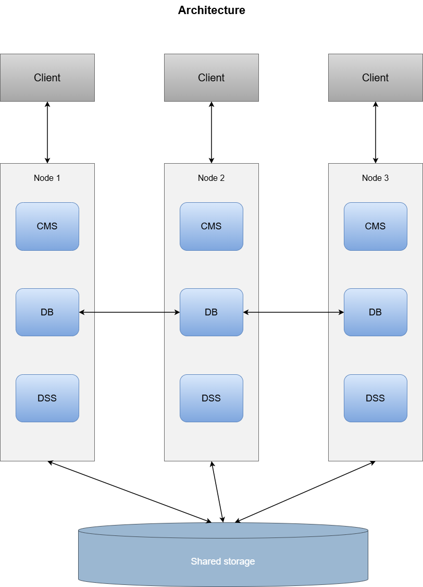
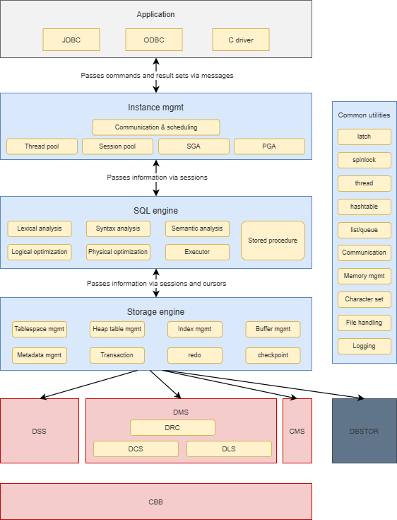

# Architecture Overview

<!-- md-trans-meta sourceCommit=unknown translatedAt=2026-08-05T07:45:09.143Z pushedAt=2026-08-17T00:46:29.609Z -->

## Runtime Architecture

- oGRAC is a shared-storage cluster architecture.
- It consists of the CMS cluster management component, the DB database instance component, and the DSS open-source cluster file system component.

## Logical Architecture

- Currently supported drivers include the JDBC driver, the oGRAC driver for C, and the ODBC driver. Go and Python drivers will be supported in the future.
- Instance management module: includes communication management and service scheduling, thread pool management, session pool management, global memory management (SGA), and private memory management (PGA).
- SQL engine module: supports lexical analysis, syntax analysis, semantic analysis, logical optimization, physical optimization, executor, and stored procedures.
- Storage engine module: includes tablespace management, heap table management, index management, page buffer management, DC metadata management, transaction management, redo management, and checkpoint.
- DSS is a high-performance shared cluster file system based on LUN.
- DMS is a multi-write shared cluster service that provides distributed resource control (DRC), distributed lock service (DLS), and distributed cache service (DCS).
- CMS is the cluster management component.
- CBB is a foundational capability library for DSS and DMS, covering communication, data structure, security, and file management.
