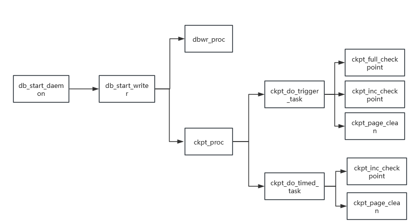

# CKPT

<!-- md-trans-meta sourceCommit=unknown translatedAt=2026-08-05T07:45:17.175Z pushedAt=2026-08-17T00:46:29.611Z -->

## Core Objectives

To achieve an optimal trade-off between durability and performance, database systems defer writes to persistent data files by first persisting modification operations to redo log files. An unbounded log would necessitate replaying the entire log sequence from the initial state during recovery, resulting in potentially severe performance degradation. The checkpoint mechanism (CKPT) is employed to mitigate this risk. It serves as a pivotal control point that synchronizes the in-memory buffer pool with on-disk data, guaranteeing both atomicity and durability while substantially reducing mean time to recovery (MTTR).

## Working Mechanism

### Key Points

oGRAC maintains several core log points, all of which share a basic structure that includes a log flush number (LFN, an incrementing sequence number) to identify the order of log batches.

`CURR_POINT`: Marks the most recent flush to disk of the database.

`TRUNC_POINT`: When dirty pages are flushed, all logs at and before this point have been flushed to disk.

`RCY_POINT`: Designates the starting point for database recovery.

`LRP_POINT`: Represents the minimum log point to which the database must recover in order to guarantee data consistency.

During `log_flush` within a checkpoint, `LRP_POINT` is advanced to `CURR_POINT`, and `RCY_POINT` is advanced to the `TRUNC_POINT` of the oldest dirty page. During recovery, log replay begins from `RCY_POINT`.

### Checkpoint Worker Thread

`ckpt_proc` is the checkpoint thread that processes checkpoint requests. It can be triggered actively or periodically/quantitatively.

`dbwr_proc` is the flush thread responsible for flushing dirty pages to data disks.

`ckpt_full_checkpoint` performs a full checkpoint.

`ckpt_inc_checkpoint` performs an incremental checkpoint.

`ckpt_page_clean` performs `PAGE_CLEAN` on the writelist.

### Incremental Checkpoint

During a full checkpoint, the database must write all modified data pages (dirty pages) to disk at once in a single batch. For a busy database, the number of dirty pages can be extremely large. Such concentrated, massive disk I/O can instantly consume substantial system resources, causing the database performance to degrade sharply during the checkpoint and resulting in a "stuttering" effect. Another problem this introduces is that checkpoint cannot be triggered frequently, which delays the advancement of the point and prolongs crash recovery time. Incremental checkpoint was designed to address these issues.

The core idea of oGRAC's incremental checkpoint is to avoid a one-time flush of all dirty pages. Instead, it continuously writes dirty pages to disk in batches. In this way, the number of dirty pages that need to be persisted at any given point in time is greatly reduced, thereby smoothing I/O writes and avoiding performance spikes.

### Batch and Concurrent Dirty Page Flushing

Conventional single-page sequential flushing incurs significant I/O overhead and latency. To optimize performance, oGRAC introduces batch and concurrent flushing techniques. Multiple dirty pages to be written are organized into a batch in memory, and then written to disk sequentially in a single operation by a background thread. This approach converts a large number of random write I/O operations into efficient sequential writes, greatly improving I/O throughput.

To further reduce latency, oGRAC launches multiple flushing threads to execute different flushing batches concurrently, fully leveraging the parallel processing capabilities of modern multi-core CPUs and storage devices. Through the combination of batch and concurrent processing, the database smooths write fluctuations, avoids I/O performance spikes, and ensures stable and efficient data persistence even under high load.

## Related Parameters

`CHECKPOINT_PERIOD`: Interval between incremental checkpoints.

`CHECKPOINT_PAGES`: Number of dirty pages between incremental checkpoints.

`BUFFER_PAGE_CLEAN_PERIOD`: Interval between `PAGE_CLEAN` operations.

`CHECKPOINT_GROUP_SIZE`: Maximum number of pages processed in a single incremental checkpoint.

`DBWR_PROCESSES`: Number of threads for dirty page flushing.

## Related Views

### DV_DATABASE

- `RCY_POINT`: Recovery information.
- `LRP_POINT`: Least recovery information.
- `CKPT_ID`: Checkpoint ID.
- `LSN`: Redo log sequence number.
- `LFN`: Redo log flush number.
- `LOG_FIRST`: Redo log start file number.
- `LOG_LAST`: Redo log end file number.
- `LOG_FREE_SIZE`: redo log free space.

### DV_SYS_STATS

- `CKPT avg merge io`: Average number of I/O merges for dirty page flushing.
- `CKPT last merge io`: Number of I/O merges in the last dirty page flushing.
