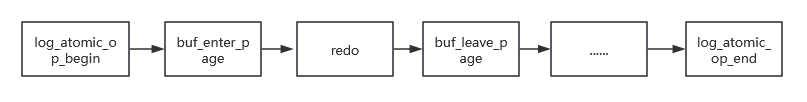

# Redo

<!-- md-trans-meta sourceCommit=unknown translatedAt=2026-08-05T07:45:18.492Z pushedAt=2026-08-17T00:46:29.613Z -->

## Core Objectives

For performance reasons, all data modifications in a database are performed in memory buffers. If every modification were written back to disk immediately, performance would be severely degraded. However, if modifications are never written back, all in-memory changes will be lost in the event of a database crash. The redo log is designed to address this problem. Its core objective is to ensure transaction durability: once a transaction is committed, the modifications it has made to the data are permanently preserved and will never be lost, even if a system crash occurs subsequently.

## Working Mechanism

### Log Atomic Operations

A write operation records redo/undo on different pages. If a power failure occurs between these records, the database, upon restart and rollback of uncommitted transactions, cannot find the required logs, resulting in data inconsistency. Therefore, oGRAC implements atomic log operations. Within an atomic operation, either all actions are performed or none are, thereby achieving atomic persistence of redo/undo.

When `buffer_enter_page` is invoked, an exclusive lock is placed on the page, preventing other connections from reading or writing it. When `buffer_leave_page` is invoked, the page lock is downgraded to a shared lock, allowing other connections to read the page. The lock is fully released only when the atomic operation completes.

### Lock-Free Design

When multiple sessions generate log records, they need to directly contend for the lock of the global buffer, and each log record append operation may cause contention. If generating a single log entry involves multiple modifications (for example, multiple steps within a transaction), a lock must be acquired for each log write, leading to intense lock contention under high concurrency.

In oGRAC, when an atomic log operation begins, the log is written to the session's private buffer, and upon completion of the atomic operation, it is copied from the private buffer to the global buffer. This approach reduces global buffer lock contention to some extent. However, during the copy to the global buffer, concurrent operations by multiple sessions can still cause lock contention and degrade performance. To address this issue, oGRAC provides a multi-log buffer mechanism, which divides the global buffer into multiple parts and uses a hashing algorithm to load-balance the copy operations. To ensure log ordering, oGRAC reorders logs during restart recovery, thereby improving database runtime efficiency.

## Redo Log Management

### Redo Log File Configuration

#### Adding Redo Log Files

During a redo log switch, the next log file is automatically located. If the next redo log is in the active state, the switch cannot proceed — this condition is referred to as redo tailgating. If redo tailgating occurs frequently, it will block DML operations, making it necessary to add more redo log files.

One or more redo log files can be added on the primary or standby host. If only the log file name is provided, the log file will be added to the default path.
An absolute path can also be specified when adding a log file.

The command for adding redo log files is as follows:
`ALTER DATABASE ADD LOGFILE`
( { 'file_name' SIZE integer [ K | M | G | T | P | E ] 
 } [ , ... ] 
);

Example:
      ALTER DATABASE ADD LOGFILE ( 'testfile1' SIZE 2G BLOCKSIZE 1024);
      ALTER DATABASE ADD LOGFILE ( '/mnt/dbdata/local/ograc/tmp/data/testfile2' SIZE 2G BLOCKSIZE 1024);

#### Dropping a Redo Log File

A redo log file can be dropped from the redo log on either the primary or standby server. Only one log file can be dropped at a time. If only the file name is specified, the default log file path is automatically appended.

The command for dropping a redo log file is as follows:
`ALTER DATABASE DROP LOGFILE ( 'file_name' );`

Example:
      ALTER DATABASE DROP LOGFILE ( 'testfile1' );
      ALTER DATABASE DROP LOGFILE ( '/mnt/dbdata/local/ograc/tmp/data/testfile2' );

#### Precautions

- Redo log files must be created and deleted through SQL commands. Direct operations on redo files are not permitted.
- Redo log files can be added or deleted when the database is in the OPEN state and read/write operations are allowed.
- The number of redo log files is limited to a maximum of 256 and a minimum of 3.
- DDL operations will be blocked during the addition or deletion of redo log files, and DML operations may be briefly blocked due to a temporary pause in redo flushing. It is recommended to perform these operations during off-peak hours whenever possible.
