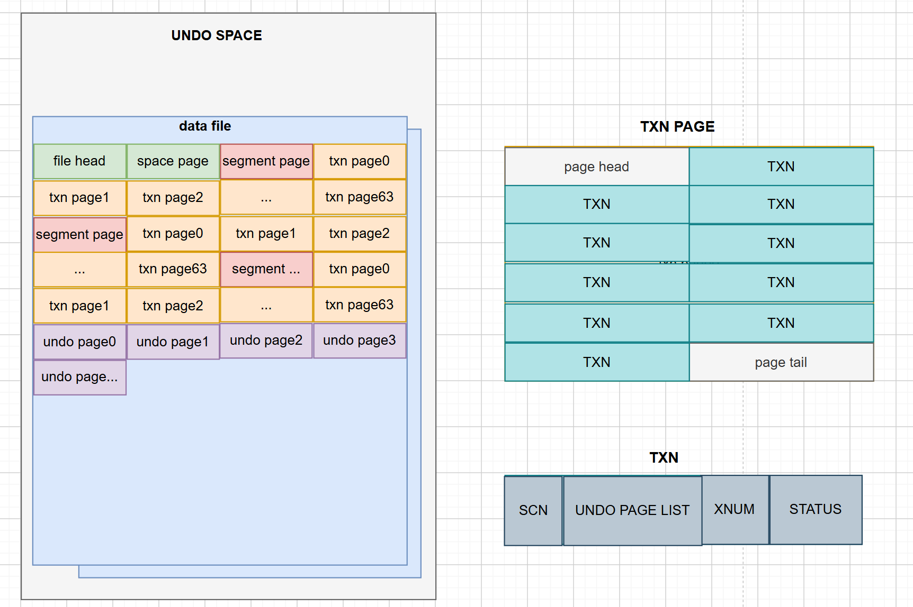
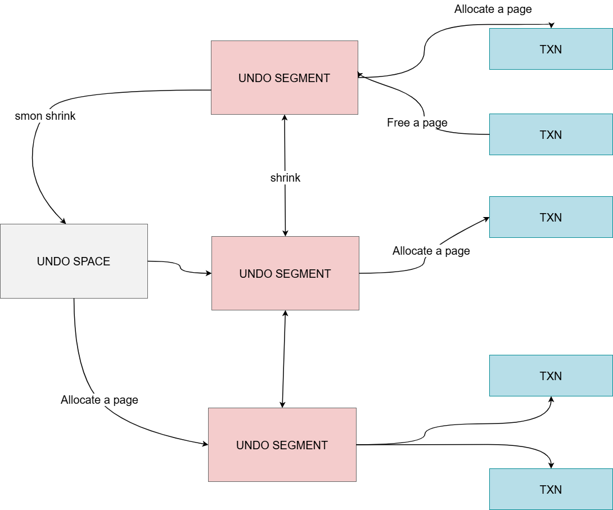
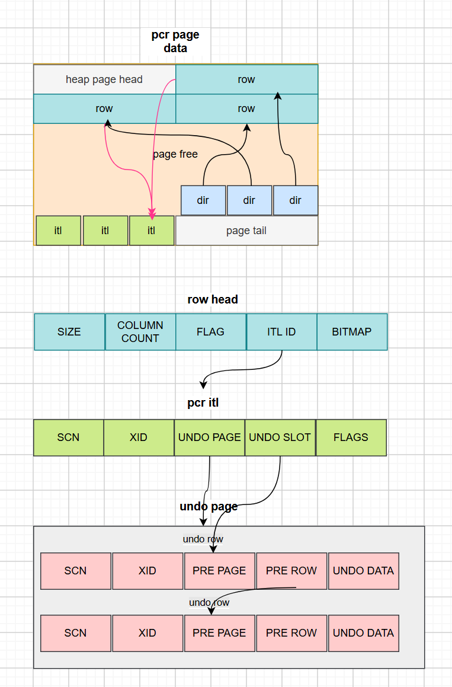
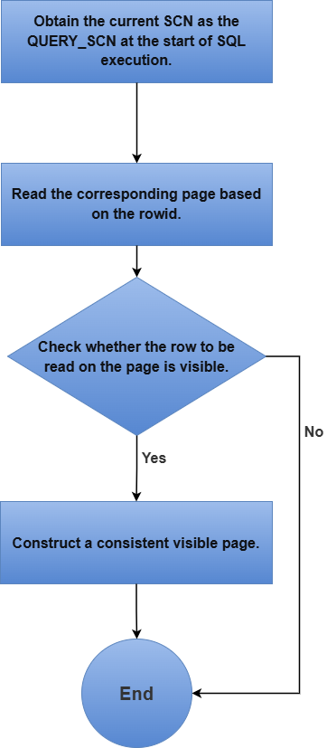
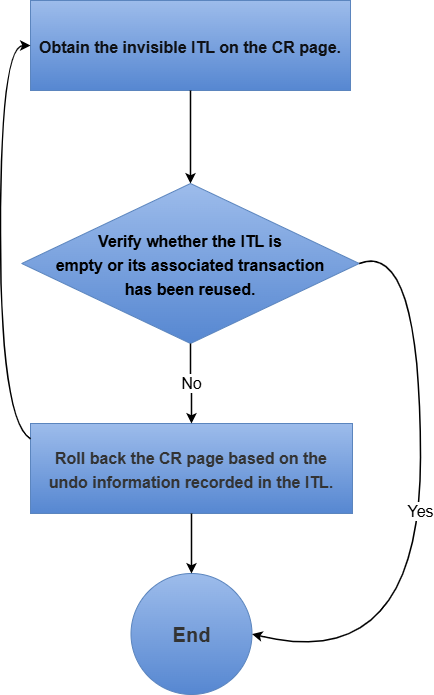
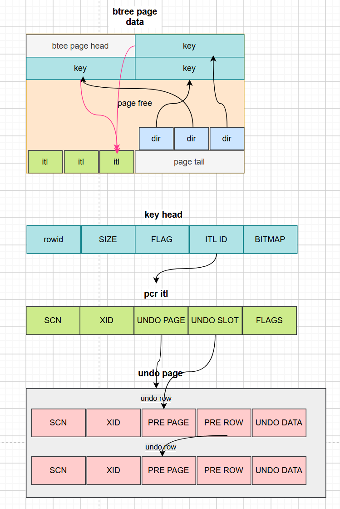

# Transaction Mechanism

<!-- md-trans-meta sourceCommit=unknown translatedAt=2026-08-05T07:46:01.161Z pushedAt=2026-08-17T00:46:29.622Z -->

The transaction mechanism ensures the atomicity, consistency, isolation, and durability of user operations, that is, it satisfies the ACID requirements.
ACID is implemented through the following technologies:

- Undo mechanism: Records the original data of each user record. During rollback, the undo data can be used for recovery, thereby ensuring the atomicity of user operations.
- Row lock mechanism: Uses row locks to ensure that the same row is not modified concurrently.
- Visibility determination: Determines whether a record is visible to the querier by comparing the querier's SCN with the record's SCN. An SCN is a 64-bit integer with a time attribute, consisting of second + microsecond + sequence. When a change occurs in the system, the global SCN of the database increments. It serves as the primary identifier for visibility determination.
- Redo mechanism: Modifications to each data page are recorded. Writing redo logs enables rapid data persistence, and the redo logs are guaranteed to be persisted to disk upon transaction commit.

## Transaction Management

### Transaction Table

The transaction table is the collection of all transaction information.

The storage structure of the transaction table is as follows:

When a transaction begins, a TXN slot is occupied. TXNs are stored in TXN pages, which are managed by undo segments. Each undo segment manages 64 TXN pages. By default, there are 32 undo segments, and this number is configurable. Undo segment information is stored in the undo space. In addition to undo management information, the undo space also stores undo page data. Undo pages store undo rows.

A TXN consists of the transaction status (indicating whether the transaction has been committed), the transaction version (used to distinguish different transactions when a TXN is reused), the SCN, and the undo page chain entry (which stores undo data).

### Rollback Segment Management

When a user operation requires writing undo data, it must request an undo page from the undo segment bound to the transaction. If no page is available in the undo segment, a request is made to the undo space. If the undo space also has no available space, an attempt is made to release undo pages from other undo segments.

If the automatic undo segment shrink option is enabled, a background thread periodically releases some pages from segments that have free undo pages back to the undo space.

### Transaction Start

oGRAC implicitly begins a transaction. There is no START TRANSACTION statement; instead, a transaction is automatically started when a user invokes a data-modifying SQL statement.

When oGRAC begins a transaction, it returns an XID, which consists of an xmap and an xnum. The xmap is equivalent to the address where a transaction information TXN is stored, and the xnum is equivalent to the reuse version number of that address.

When allocating a TXN at transaction start, the system first randomly binds to an undo segment, and then selects a TXN from the free TXN linked list on that undo segment.

### Transaction End

oGRAC ends a transaction in the following scenarios:

1. A user manually executes commit or rollback to commit or roll back the transaction it began;
2. A user executes a DDL operation, which automatically commits any unended transaction in the current session;
3. When a client exits abnormally, the server rolls back unended transactions of the abnormally exited session; when the server restarts after a failure, it also automatically rolls back unended transactions;
4. When the client exits normally, the transaction is automatically committed based on the client's default setting.

When a transaction ends, oGRAC sets the transaction's SCN and status on the TXN, releases the undo pages occupied by the transaction back to the undo segment, notifies other transactions waiting for its completion, releases lock resources, releases TXN transaction resources, and resets the transaction resource management context.

### Savepoint

A savepoint is a marker point within a transaction, used to set an intermediate point during transaction execution. With savepoints, when an error occurs in a transaction, only the operations up to the specified marker point need to be rolled back, without having to abandon all operations of the entire transaction, thereby improving transaction processing flexibility.
When a savepoint is set, oGRAC records the current transaction's undo row information and the lock information used on the transaction resource management context. When a rollback to savepoint operation is executed, the undo is rolled back to the undo row registered at the savepoint, and locks are released starting from the locks registered at the savepoint.

## Transaction Isolation Levels

The transaction isolation levels supported by oGRAC are Read Committed and Serializable.

### Read Committed (RC)

The RC isolation level ensures that when a transaction accesses data modified by other transactions, it can only read committed data versions. This prevents dirty reads but allows non-repeatable reads.

### Serializable

Under this isolation level, transactions are completely isolated from one another, ensuring that no conflicts arise between concurrent transactions and preventing dirty reads, non-repeatable reads, and phantom reads.

## Multi-Version Concurrency Control (MVCC)

The MVCC scheme is as follows: multiple versions of data are maintained, where read operations access historical versions and write operations modify the current version, so that the two do not interfere with each other and concurrent reads and writes are achieved.
The MVCC mechanism of oGRAC relies on two core components working in coordination: Undo data and SCN, which implement multi-version access through versioned data and timestamp markers.
oGRAC implements the read committed isolation level and the serializable isolation level through MVCC.

### Heap MVCC

oGRAC employs page-level consistent read, in which a visible page is first constructed before row data is read.

The dir entries in a page record the offset positions of the corresponding rows on the page.

When a transaction performs an insert, delete, or update on a page, it must apply for an ITL to manage and lock the records on that page. A single ITL on a page can manage multiple rows belonging to the same transaction.

When a transaction modifies row data on a page, undo rows are written. An undo row records the data before modification, and they are linked together in a chain. The ITL registers the address of the last undo record. The row head registers the ITL ID used, and each row can locate the corresponding ITL information based on this ITL ID.

#### Heap Fetch Row Visibility Determination Process

##### Visibility Determination Process When Heap Fetch Retrieves a Row by rowid

1. When SQL execution begins, the current system SCN is obtained as the `QUERY_SCN` for the current query.
2. When checking whether a row on the page is visible, if the `itlid` in the row head is invalid, it indicates that the ITL corresponding to this row has been reused and the corresponding transaction has been committed. The SCN on the current page is taken as the SCN of the previous transaction for this row, because when an ITL is reused, the SCN of the previous ITL is copied to the page-level SCN. Similarly, if the row was locked and then the lock was released without modification, the previous transaction is also considered to have been committed.
3. If the ITL is valid, the active status of the ITL is checked. If the active status is false, the transaction is considered to have ended. If the active status is true, the transaction status in TXN must be examined, because the update of the ITL active flag is implemented in a deferred manner — that is, it is not modified immediately upon transaction commit. Based on the xnum transaction version number and the status in TXN, whether the TXN has been reused is determined, so as to obtain the appropriate SCN and status of the transaction.
4. If the transaction has not been committed and is not the current transaction, the row is invisible; if the transaction has been committed and the SCN of the committed transaction is less than `QUERY_SCN`, the row is visible; otherwise, it is invisible.
5. If the row remains invisible, a consistent read page must be constructed to obtain a readable row record.

##### Process of Constructing a Consistent-Read Page

1. Copy the current heap page to a CR page, which is allocated from the CR page pool.
2. When obtaining an invisible ITL on the page, if the transaction corresponding to the ITL has been committed and the TXN has been reused, a "snapshot is too old" error must be reported. Otherwise, obtain an uncommitted ITL or an ITL whose SCN is greater than `QUERY_SCN`. If no such ITL is found, the CR page construction is complete and the process returns directly. When selecting a committed ITL, the one with the larger SCN is rolled back first to prevent inter-transaction dependencies.
3. If the transaction corresponding to the ITL is not on the local node, the construction must be sent to the corresponding node.
4. When rolling back the undo row corresponding to the ITL, continue rolling back until reaching the undo of the ITL.

### B-tree MVCC

MVCC processing for B-tree pages is similar to that for heap pages, except that the ITL ID of a B-tree is stored on the key head.
