# SQL Capabilities

<!-- md-trans-meta sourceCommit=unknown translatedAt=2026-08-05T07:46:08.213Z pushedAt=2026-08-17T00:46:29.625Z -->

## Basic Capabilities

- Supported SQL standards

    SQL is a standardized language jointly defined by the American National Standards Institute (ANSI) and the International Organization for Standardization (ISO). The most prominent industry standards are SQL92 and SQL99. The SQL standard consists of ten parts, one of which (SQL/RPR:2012) was added in 2012, five parts were revised in 2011, and the remaining four parts still follow the 2008 version.
    oGRAC currently complies with the **SQL:2003** standard, and provides partial support for subsequent standards such as SQL:2006, SQL:2008, SQL:2011, and SQL:2016. The main incompatibilities are as follows:

    - `WHERE CURRENT OF` is not supported.
    - `WITH HOLD` is not supported.
    - `FOREIGN DATA WRAPPER` is not supported.
    - `SECURITY LABEL` is not supported.

- Supported development interfaces

    oGRAC provides industry-standard JDBC interfaces, ensuring that user services can be quickly migrated to oGRAC.
    Currently, the standard JDBC 4.0 interface is supported, and JDBC supports common Linux and Windows platforms.

- Supported SQL statements

    In oGRAC, all operations on data are performed through SQL statements. An SQL statement mainly consists of identifiers, parameters, variables, names, data types, and SQL reserved words. The types of SQL statements supported by oGRAC can be classified into database control statements `DCL(Data Control Language)`, data definition statements `DDL(Data Definition Language)`, data manipulation statements `DML(Data Manipulation Language)`, and data query statements `DQL(Data Query Language)`.

    - DCL: Used to set or change database transactions, user permissions, lock tables, and so on.
    - DDL: Used to define or modify objects in the database, such as tables, directories, indexes, views, synonyms, databases, sequences, users, roles, tablespaces, sessions, and so on.
    - DML: Used to operate on data in database tables, such as inserting, updating, and deleting.
    - DQL: Used to query data in database tables.

- Supports functions and stored procedures

    In oGRAC, standard SQL functions and stored procedures are supported. A stored procedure is a collection of SQL statements designed to accomplish a specific function, typically used for report statistics, data migration, and similar tasks. A function is an internal encapsulation of certain business logic to perform a specific function. After execution, a function returns the execution result. The functions currently supported by oGRAC include numerical computation, date and time, character processing, aggregate analysis, type casting, grouping, intervals, table processing, and more.

## SQL Processing Flow

The SQL processing flow in oGRAC includes syntax parsing, query rewriting, query optimization, execution plan creation, and execution plan. Depending on the statement, the database may skip certain steps. As shown in the following figure:

- SQL parsing

  The first stage of SQL processing is SQL parsing. When an app issues an SQL statement, the database initiates a parse call to prepare the statement for execution. The parse call opens or creates a cursor (`cursor`), which is a handle for a session-specific private SQL area that holds the parsed SQL statement and other processing information. During the parse call, the database performs syntax checking and semantic checking.

  - oGRAC supports caching of SQL statements and anonymous blocks (`PL/SQL`). It can compare user-input SQL statements or anonymous blocks (`PL/SQL`) against copies in the plan cache. If an identical statement already exists in the cache and does not involve invalid database objects, the cached plan is used directly, bypassing the plan generation process.

- SQL optimization

  SQL optimization is further divided into logical optimization and physical optimization, corresponding to the query rewrite optimization and cost-based query path optimization in the diagram. The database first performs equivalent transformations on the abstract syntax tree based on static transformation rules, and then calculates the physical cost of different query paths based on the collected (or estimated) statistical information of the actual accessed data, selecting the query path with the lowest cost to generate an execution plan.

- SQL execution

  During the SQL execution phase, iterative execution is performed according to the execution plan generated by the optimizer. During execution, if the required data is not in the current memory, the database reads the data from disk into memory. The database also acquires necessary locks to ensure data integrity. In the final stage of processing the SQL statement, the cursor is closed.

  - oGRAC supports using the `explain` statement to view the execution plan of the current statement, allowing you to intuitively see the execution order of statements, join methods, and corresponding filter conditions or join conditions in the current execution plan.

## SQL Optimizer Capabilities

### Logical Optimization

SQL syntax is flexible and diverse, and SQL statements written by different people or tools vary widely. As a result, SQL statements sent to the database often contain redundant logic and rarely achieve optimal execution efficiency. The purpose of logical optimization is to rewrite user-input SQL statements into more efficient equivalent SQL. Logical optimization, also known as query rewriting, primarily applies heuristic rules and relational algebra theory to rewrite SQL statements that match specific scenarios. The query rewriting process follows two fundamental principles: equivalence and efficiency.

Key query rewriting optimizations currently supported by oGRAC include:

- OR-to-UNION transformation
- Condition reorganization
- Sort elimination
- Subquery elimination
- IN-to-EXISTS conversion
- Subquery-to-Table conversion
- Outer join elimination
- Predicate pushdown
- Predicate propagation
- Sort pushdown
- Group aggregation pushdown
- Hash materialization optimization
- Sort group optimization
- Cube group optimization
- Exists condition degradation
- Distinct elimination
- Projection column elimination
- Subquery table elimination
- Connect by pushdown
- Connect by materialization optimization
- ANY/ALL transformation
- ROWNUM condition optimization
- Subquery to window function conversion
- IN-list result set optimization
- Semi-join to inner join conversion

### Cost-Based Optimizer (CBO)

The optimizer in oGRAC is a typical cost-based optimizer (CBO). Under this optimizer model, the database calculates the number of output tuples and execution cost for each execution method of every execution step based on table characteristics such as the number of tuples, field width, NULL record ratio, distinct values, MCV values, and HB values, as well as a defined cost calculation model. It then selects the execution method with the lowest overall execution cost or the lowest first-tuple return cost for execution.

The CBO optimizer can select the most efficient execution plan from numerous candidate plans based on cost, meeting customer business requirements to the greatest extent possible.

Main CBO features currently supported by oGRAC include:

- Minimum-cost path selection based on dynamic programming
- Index scan
- Selectivity and cost estimation
- Single-column and multi-column predicates
- Scan path generation for index unique/range/full/fast/skip/only syntax
- Plan path generation for distinct/group by/order by syntax
- Multi-table joins including inner join, outer join, semi/anti join, full join, and left join
- Generating execution paths for nest loop join
- Generating execution paths for hash join
- Generating execution paths for merge join
- Cost estimation for partitioned tables
- SQL HINT
- Index scan in OR scenarios
- Index scan without statistics
- Index scan for `like`/`in`/`between and`/`is[not] null`/`true`/`false` statements

### Dynamic Thread Pool Management

In the OLTP domain, databases need to handle a large number of client connections. Therefore, the ability to handle high-concurrency scenarios is one of the key capabilities of a database.

The simplest processing mode for external connections is the per-thread-per-connection mode, where a thread is created for each incoming user connection. The advantage of this mode is its architectural simplicity. However, under high concurrency, the excessive number of threads leads to frequent thread switching and severe contention in the database's lightweight lock regions, causing a sharp decline in performance and a significant drop in system throughput, which fails to meet the user's performance service-level agreement (SLA).

Therefore, it is necessary to solve this problem through thread resource pooling and reuse. The overall design philosophy of thread pool technology is to pool thread resources and reuse them across different connections. After the system starts, it launches a fixed number of worker threads based on the current core count or user configuration. Each worker thread serves one or more connection sessions, thereby decoupling sessions from threads. Since the number of worker threads is fixed, frequent thread switching is avoided under high concurrency, and session scheduling management is handled at the database layer.

oGRAC supports dynamic thread pool management, which can automatically adjust thread resources based on the current workload without DBA intervention.
