# oGRAC Partitioned Table Management

<!-- md-trans-meta sourceCommit=unknown translatedAt=2026-08-14T11:01:13.450Z pushedAt=2026-08-24T08:20:29.393Z -->

## Background

A partitioned table is a technique that physically splits a large table into multiple smaller tables according to rules (such as date or region). Logically it remains a single table, but this is transparent to users. The core advantage is a significant improvement in query performance (the database scans only the relevant partitions, which is called partition pruning), and simplified data management (individual partitions can be quickly archived or backed up). It is commonly used to handle massive historical data, enabling efficient querying and maintenance.

oGRAC partitioned tables provide four partitioning strategies, each addressing different usage scenarios.

- Hash partitioning: Applies a hash function to the partition key (for example, an ID column), and distributes data rows randomly and evenly across partitions based on the computed hash values. It is commonly used to eliminate hotspots, achieve I/O load balancing, and is suitable for equality queries.

- Range partitioning: Divides data according to continuous value ranges of the partition key (such as dates or numeric sequences). Each partition contains data within a specific range. It is especially suitable for data that has a natural, continuous dimension highly correlated with business query patterns.

- List partitioning: A highly intuitive and practical partitioning strategy that explicitly assigns data rows to partitions based on discrete values of the partition key (such as categories, statuses, and region codes). Each partition contains a predefined set of non-contiguous values. It is best suited for scenarios where data can be logically grouped according to several distinct, non-contiguous values of a column.

- Interval partitioning: An extension of range partitioning. You only need to define an initial partition range and a fixed time interval, and the database automatically creates new partitions as needed. Interval partitioning is perfectly suited for scenarios that require automated, maintenance-free management of time-series data.

## Partitioned Table Management

### Creating a Partitioned Table

#### Syntax

The syntax for creating a partitioned table is similar to that for creating a regular table, with the PartitionOpt clause added to table_properties.

**PartitionOpt:**

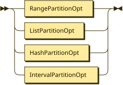

```
PartitionOpt
         ::= RangePartitionOpt
           | ListPartitionOpt
           | HashPartitionOpt
           | IntervalPartitionOpt
```

**RangePartitionOpt:**

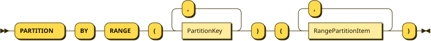

```
RangePartitionOpt
         ::= 'PARTITION' 'BY' 'RANGE' '(' PartitionKey ( ',' PartitionKey )* ')' '(' RangePartitionItem ( ',' RangePartitionItem )* ')'
```

Referenced by:

* PartitionOpt

**RangePartitionItem:**

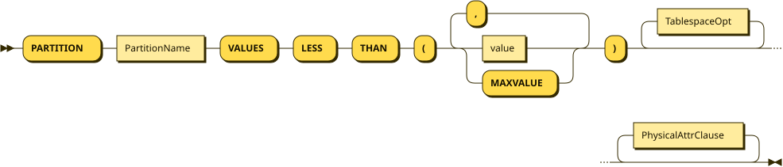

```
RangePartitionItem
         ::= 'PARTITION' PartitionName 'VALUES' 'LESS' 'THAN' '(' ( value | 'MAXVALUE' ) ( ',' ( value | 'MAXVALUE' ) )* ')' TablespaceOpt* PhysicalAttrClause*
```

Referenced by:

* IntervalPartitionOpt

* RangePartitionOpt

**ListPartitionOpt:**

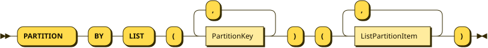

```
ListPartitionOpt
         ::= 'PARTITION' 'BY' 'LIST' '(' PartitionKey ( ',' PartitionKey )* ')' '(' ListPartitionItem ( ',' ListPartitionItem )* ')'
```

Referenced by:

* PartitionOpt

**ListPartitionItem:**

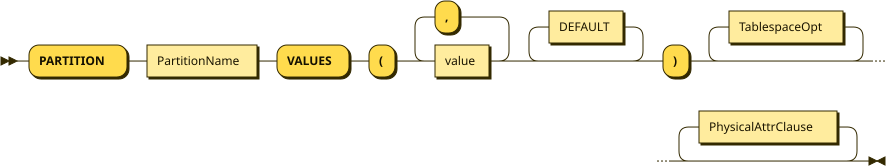

```
ListPartitionItem
         ::= 'PARTITION' PartitionName 'VALUES' '(' value ( ',' value )* DEFAULT* ')' TablespaceOpt* PhysicalAttrClause*
```

Referenced by:

* ListPartitionOpt

**HashPartitionOpt:**

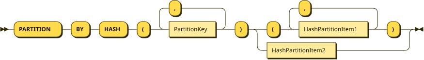

```
HashPartitionOpt
         ::= 'PARTITION' 'BY' 'HASH' '(' PartitionKey ( ',' PartitionKey )* ')' ( '(' HashPartitionItem1 ( ',' HashPartitionItem1 )* ')' | HashPartitionItem2 )
```

Referenced by:

* PartitionOpt

**HashPartitionItem1:**


```
HashPartitionItem1
         ::= 'PARTITION' PartitionName TablespaceOpt* PhysicalAttrClause*
```

Referenced by:

* HashPartitionOpt

**HashPartitionItem2:**

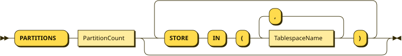

```
HashPartitionItem2
         ::= 'PARTITIONS' PartitionCount ( 'STORE' 'IN' '(' TablespaceName ( ',' TablespaceName )* ')' )*
```

Referenced by:

* HashPartitionOpt

**IntervalPartitionOpt:**

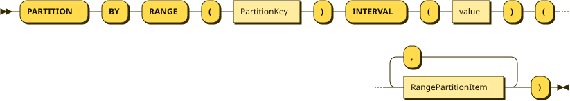

```
IntervalPartitionOpt
         ::= 'PARTITION' 'BY' 'RANGE' '(' PartitionKey ')' 'INTERVAL' '(' value ')' '(' RangePartitionItem ( ',' RangePartitionItem )* ')'
```

Referenced by:

* PartitionOpt

**TablespaceOpt:**


```
TablespaceOpt
         ::= 'TABLESPACE' TablespaceName
```

Referenced by:

* HashPartitionItem1

* ListPartitionItem

* RangePartitionItem

**PartitionKey:**


```
PartitionKey
         ::= Column
```

Referenced by:

* HashPartitionOpt

* IntervalPartitionOpt

* ListPartitionOpt

* RangePartitionOpt

#### Examples

```sql
-- Range partitioning

CREATE TABLE sales_range (
sale_id NUMBER,
sale_date DATE,
amount NUMBER,
region VARCHAR2(50)
)
PARTITION BY RANGE (sale_date) (
PARTITION sales_q1 VALUES LESS THAN (TO_DATE('2024-04-01', 'YYYY-MM-DD')),
PARTITION sales_q2 VALUES LESS THAN (TO_DATE('2024-07-01', 'YYYY-MM-DD')),
PARTITION sales_q3 VALUES LESS THAN (TO_DATE('2024-10-01', 'YYYY-MM-DD')),
PARTITION sales_q4 VALUES LESS THAN (MAXVALUE)
);

-- List partitioning

CREATE TABLE employees_list (
emp_id NUMBER,
emp_name VARCHAR2(100),
department VARCHAR2(50),
salary NUMBER
)
PARTITION BY LIST (department) (
PARTITION dept_sales VALUES ('SALES', 'MARKETING'),
PARTITION dept_tech VALUES ('IT', 'ENGINEERING'),
PARTITION dept_hr VALUES ('HR', 'ADMIN'),
PARTITION dept_other VALUES (DEFAULT)
);

-- Hash partitioning method 1: specify the partition name

CREATE TABLE products_hash (
product_id NUMBER,
product_name VARCHAR2(200),
category VARCHAR2(100)
)
PARTITION BY HASH (product_id) (
PARTITION p1,
PARTITION p2,
PARTITION p3,
PARTITION p4
);

-- Hash partitioning method 2: specify the number of partitions

CREATE TABLE orders_hash (
order_id NUMBER,
order_date DATE,
customer_id NUMBER
)
PARTITION BY HASH (order_id)
PARTITIONS 8;

-- Interval Partitioning
CREATE TABLE sales_interval (
sale_id NUMBER,
sale_date DATE,
amount NUMBER,
region VARCHAR2(50)
)
PARTITION BY RANGE (sale_date)
INTERVAL (NUMTOYMINTERVAL(1, 'MONTH'))
(
PARTITION sales_historical VALUES LESS THAN (TO_DATE('2024-01-01', 'YYYY-MM-DD')),
PARTITION sales_jan_2024 VALUES LESS THAN (TO_DATE('2024-02-01', 'YYYY-MM-DD'))
);
```

### Deleting a Partitioned Table

#### Syntax

The syntax for dropping a partitioned table is the same as that for dropping a regular table.

```bnf
DropTableStmt ::=
    'DROP' 'TABLE' ( 'IF' 'EXISTS' )* TableName ( ',' TableName )* ( 'CASCADE' | 'RESTRICT' )* 'PURGE'*

TableName ::=
    (schema.)*table_name
```

#### Example

```sql
DROP TABLE sales_range ;
```

### Partition Management

#### Syntax

**AlterTableStmt:**

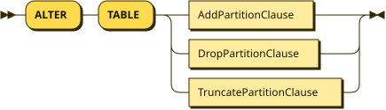

```
AlterTableStmt
         ::= 'ALTER' 'TABLE' ( AddPartitionClause | DropPartitionClause | TruncatePartitionClause )
```

**AddPartitionClause:**

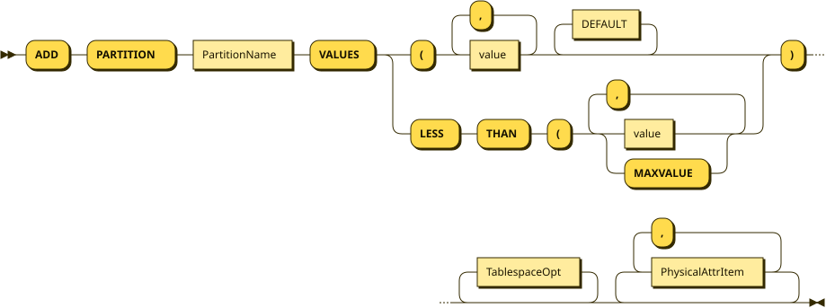

```
AddPartitionClause
         ::= 'ADD' 'PARTITION' PartitionName 'VALUES' ( 'LESS' 'THAN' '(' ( value | 'MAXVALUE' ) ( ',' ( value | 'MAXVALUE' ) )* | '(' value ( ',' value )* DEFAULT* ) ')' TablespaceOpt* ( PhysicalAttrItem ( ',' PhysicalAttrItem )* )*
```

Referenced by:

* AlterTableStmt

**TableName:**

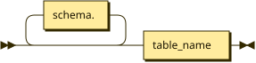

```
TableName
         ::= schema.* table_name
```

**TablespaceOpt:**


```
TablespaceOpt
         ::= 'TABLESPACE' TablespaceName
```

Referenced by:

* AddPartitionClause

**PhysicalAttrItem:**

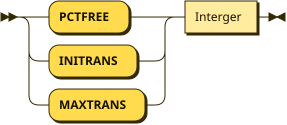

```
PhysicalAttrItem
         ::= ( 'PCTFREE' | 'INITRANS' | 'MAXTRANS' ) Interger
```

Referenced by:

* AddPartitionClause

**DropPartitionClause:**


```
DropPartitionClause
         ::= 'DROP' 'PARTITION' PartitionName
```

Referenced by:

* AlterTableStmt

**TruncatePartitionClause:**


```
TruncatePartitionClause
         ::= 'TRUNCATE' 'PARTITION' PartitionName TruncatePartitionStorage* 'STORAGE'
```

Referenced by:

* AlterTableStmt

**TruncatePartitionStorage:**

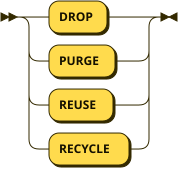

```
TruncatePartitionStorage
         ::= 'DROP'
           | 'PURGE'
           | 'REUSE'
           | 'RECYCLE'
```

Referenced by:

* TruncatePartitionClause

#### Examples

```sql
-- Delete a partition (if it is empty or has been backed up).

ALTER TABLE sales_range DROP PARTITION sales_q4;

-- Add a new partition.

ALTER TABLE sales_range ADD PARTITION sales_q1_2025
VALUES LESS THAN (TO_DATE('2025-04-01', 'YYYY-MM-DD'));

-- Truncate partition data.

ALTER TABLE sales_range TRUNCATE PARTITION sales_q2;
```

### Querying Partitions

#### Syntax

Querying a partitioned table is similar to querying a regular table, except that a PartitionClause needs to be added.

```bnf
PartitionClause ::=
    'PARTITION'
    ( '(' PartitionName ')'
|   'FOR' '(' PartitionValue ( ',' PartitionValue )* ')')
```

#### Examples

```sql
--Query the specified partition.

SELECT * FROM sales_range PARTITION (sales_q1);

--Query the partition with the specified partition key value.

SELECT * FROM sales_range PARTITION FOR (TO_DATE('2024-04-01', 'YYYY-MM-DD'));
```

## Partitioned Index Management

### Creating a Partitioned Index

#### Syntax

```bnf
PartitionIndexClause ::=
    ( 'LOCAL' '(' 'PARTITION' PartitionName (  ',' 'PARTITION' PartitionName )* ')' )*
```

#### Examples

```sql
----Create a GLOBAL index.

CREATE INDEX sales_global_idx ON sales_range(sale_id) ;

----Create a LOCAL index.

CREATE INDEX sales_local_idx ON sales_range(region) LOCAL;
```

### Dropping a Partitioned Index

#### Syntax

#### Example

```sql
-- Drop a GLOBAL index.

DROP INDEX sales_global_idx ON sales_range ;
```
