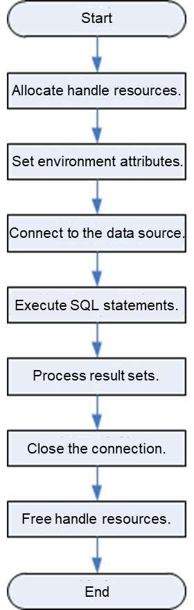

# Development Process

<!-- md-trans-meta sourceCommit=unknown translatedAt=2026-07-21T11:26:31.007Z pushedAt=2026-07-22T02:14:05.953Z -->

**Figure 1**  ODBC application development process  

## APIs Involved in the Development Process

**Table 1**  Related APIs

<table><thead align="left"><tr id="zh-cn_topic_0237120409_zh-cn_topic_0059778957_ra4bc7ab7d7a7493ea839a0e52ecf4825"><th class="cellrowborder" valign="top" width="37.2%" id="mcps1.2.3.1.1">
<strong id="zh-cn_topic_0237120409_zh-cn_topic_0059778957_a2b60e1107ec14759972d891c2c5424dd">Function</strong>
</th>
<th class="cellrowborder" valign="top" width="62.8%" id="mcps1.2.3.1.2">
<strong id="zh-cn_topic_0237120409_zh-cn_topic_0059778957_a16bae9c276314a118debccb05cc4734f">API</strong>
</th>
</tr>
</thead>
<tbody><tr id="zh-cn_topic_0237120409_zh-cn_topic_0059778957_r6ff7b44edfc64cc69677920a5fd8a9af"><td class="cellrowborder" valign="top" width="37.2%" headers="mcps1.2.3.1.1 ">
Allocates handle resources
</td>
<td class="cellrowborder" valign="top" width="62.8%" headers="mcps1.2.3.1.2 ">
<a href="sql_alloc_handle.md">SQLAllocHandle</a>: Allocates handle resources. It can replace the following functions:

<ul id="zh-cn_topic_0237120409_zh-cn_topic_0059778957_u9a01eda0e47a4f5791a8febb1bb4d13d"><li><a href="sql_alloc_env.md">SQLAllocEnv</a>: Allocates an environment handle.</li><li><a href="sql_alloc_connect.md">SQLAllocConnect</a>: Allocates a connection handle.</li><li><a href="sql_alloc_stmt.md">SQLAllocStmt</a>: Allocates a statement handle.</li></ul></td>
</tr>
<tr id="zh-cn_topic_0237120409_zh-cn_topic_0059778957_reca69a78621d4b29bfdbb97fc83bb8d8"><td class="cellrowborder" valign="top" width="37.2%" headers="mcps1.2.3.1.1 ">
Sets environment attributes
</td>
<td class="cellrowborder" valign="top" width="62.8%" headers="mcps1.2.3.1.2 ">
<a href="sql_set_env_attr.md">SQLSetEnvAttr</a>
</td>
</tr>
<tr id="zh-cn_topic_0237120409_zh-cn_topic_0059778957_r8a93f2fb0cf94874b2c487c93cf898c8"><td class="cellrowborder" valign="top" width="37.2%" headers="mcps1.2.3.1.1 ">
Sets connection attributes
</td>
<td class="cellrowborder" valign="top" width="62.8%" headers="mcps1.2.3.1.2 ">
<a href="sql_set_connect_attr.md">SQLSetConnectAttr</a>
</td>
</tr>
<tr id="zh-cn_topic_0237120409_zh-cn_topic_0059778957_r215312d81bd845ef9af783522d0a5d31"><td class="cellrowborder" valign="top" width="37.2%" headers="mcps1.2.3.1.1 ">
Sets statement attributes
</td>
<td class="cellrowborder" valign="top" width="62.8%" headers="mcps1.2.3.1.2 ">
<a href="sql_set_stmt_attr.md">SQLSetStmtAttr</a>
</td>
</tr>
<tr id="zh-cn_topic_0237120409_zh-cn_topic_0059778957_r6b385e2697d94978b0f72e9c319dfc62"><td class="cellrowborder" valign="top" width="37.2%" headers="mcps1.2.3.1.1 ">
Connects to the data source
</td>
<td class="cellrowborder" valign="top" width="62.8%" headers="mcps1.2.3.1.2 ">
<a href="sql_connect.md">SQLConnect</a>
</td>
</tr>
<tr id="zh-cn_topic_0237120409_zh-cn_topic_0059778957_r74f5e5648cc545bd989724498fd61272"><td class="cellrowborder" valign="top" width="37.2%" headers="mcps1.2.3.1.1 ">
Binds buffers to columns in the result set
</td>
<td class="cellrowborder" valign="top" width="62.8%" headers="mcps1.2.3.1.2 ">
<a href="sql_bind_col.md">SQLBindCol</a>
</td>
</tr>
<tr id="zh-cn_topic_0237120409_zh-cn_topic_0059778957_r2310b53cbeb44e5189d23d8cb4d54e93"><td class="cellrowborder" valign="top" width="37.2%" headers="mcps1.2.3.1.1 ">
Binds a parameter marker and buffer for an SQL statement
</td>
<td class="cellrowborder" valign="top" width="62.8%" headers="mcps1.2.3.1.2 ">
<a href="sql_bind_parameter.md">SQLBindParameter</a>
</td>
</tr>
<tr id="zh-cn_topic_0237120409_zh-cn_topic_0059778957_r64f440bf6f134ca09eb319dce4445f92"><td class="cellrowborder" valign="top" width="37.2%" headers="mcps1.2.3.1.1 ">
Prepares for executing an SQL statement
</td>
<td class="cellrowborder" valign="top" width="62.8%" headers="mcps1.2.3.1.2 ">
<a href="sql_prepare.md">SQLPrepare</a>
</td>
</tr>
<tr id="zh-cn_topic_0237120409_zh-cn_topic_0059778957_r86d122da7e6a45a98abd0d2c1ceeb611"><td class="cellrowborder" valign="top" width="37.2%" headers="mcps1.2.3.1.1 ">
Executes a prepared SQL statement
</td>
<td class="cellrowborder" valign="top" width="62.8%" headers="mcps1.2.3.1.2 ">
<a href="sql_execute.md">SQLExecute</a>
</td>
</tr>
<tr id="zh-cn_topic_0237120409_zh-cn_topic_0059778957_r62d4c8e0f9d3431399af1211f6fb6ee2"><td class="cellrowborder" valign="top" width="37.2%" headers="mcps1.2.3.1.1 ">
Directly executes an SQL statement
</td>
<td class="cellrowborder" valign="top" width="62.8%" headers="mcps1.2.3.1.2 ">
<a href="sql_exec_direct.md">SQLExecDirect</a>
</td>
</tr>
<tr id="zh-cn_topic_0237120409_zh-cn_topic_0059778957_r568da8c171a74a8e84f5f8c8c0979afc"><td class="cellrowborder" valign="top" width="37.2%" headers="mcps1.2.3.1.1 ">
Fetches a rowset from the result set
</td>
<td class="cellrowborder" valign="top" width="62.8%" headers="mcps1.2.3.1.2 ">
<a href="sql_fetch.md">SQLFetch</a>
</td>
</tr>
<tr id="zh-cn_topic_0237120409_zh-cn_topic_0059778957_r38d974abf84e450ca7f96100e8a6a077"><td class="cellrowborder" valign="top" width="37.2%" headers="mcps1.2.3.1.1 ">
Returns data of a column in the result set
</td>
<td class="cellrowborder" valign="top" width="62.8%" headers="mcps1.2.3.1.2 ">
<a href="sql_get_data.md">SQLGetData</a>
</td>
</tr>

<tr id="zh-cn_topic_0237120409_zh-cn_topic_0059778957_r38d974abf84e450ca7f96100e8a6a077"><td class="cellrowborder" valign="top" width="37.2%" headers="mcps1.2.3.1.1 ">
Sends data to the server in batches
</td>
<td class="cellrowborder" valign="top" width="62.8%" headers="mcps1.2.3.1.2 ">
<a href="sql_put_data.md">SQLPutData</a>
</td>
</tr>

<tr id="zh-cn_topic_0237120409_zh-cn_topic_0059778957_r38d974abf84e450ca7f96100e8a6a077"><td class="cellrowborder" valign="top" width="37.2%" headers="mcps1.2.3.1.1 ">
Obtains the number of rows affected by the most recently executed SQL statement
</td>
<td class="cellrowborder" valign="top" width="62.8%" headers="mcps1.2.3.1.2 ">
<a href="sql_row_count.md">SQLRowCount</a>
</td>
</tr>

<tr id="zh-cn_topic_0237120409_zh-cn_topic_0059778957_r91f9e273dc364f31b8661698941c8f92"><td class="cellrowborder" valign="top" width="37.2%" headers="mcps1.2.3.1.1 ">
Obtains error information
</td>
<td class="cellrowborder" valign="top" width="62.8%" headers="mcps1.2.3.1.2 ">
<a href="sql_error.md">SQLError</a>
</td>
</tr>
<tr id="zh-cn_topic_0237120409_zh-cn_topic_0059778957_re2de0c9ab1fd476dad5108b6e9a8e21c"><td class="cellrowborder" valign="top" width="37.2%" headers="mcps1.2.3.1.1 ">
Disconnects from the data source
</td>
<td class="cellrowborder" valign="top" width="62.8%" headers="mcps1.2.3.1.2 ">
<a href="sql_disconnect.md">SQLDisconnect</a>
</td>
</tr>
<tr id="zh-cn_topic_0237120409_zh-cn_topic_0059778957_r2f6f79089ce944fc96e3c5299ab3529d"><td class="cellrowborder" valign="top" width="37.2%" headers="mcps1.2.3.1.1 ">
Frees handle resources
</td>
<td class="cellrowborder" valign="top" width="62.8%" headers="mcps1.2.3.1.2 ">
<a href="sql_free_handle.md">SQLFreeHandle</a>: Frees handle resources. It can replace the following functions:

<ul id="zh-cn_topic_0237120409_zh-cn_topic_0059778957_u912c46b1932d4d4b8b4136bd8317d0b5"><li><a href="sql_free_env.md">SQLFreeEnv</a>: Frees the environment handle.</li><li><a href="sql_free_connect.md">SQLFreeConnect</a>: Frees the connection handle.</li><li><a href="sql_free_stmt.md">SQLFreeStmt</a>: Frees the statement handle.</li></ul></td>
</tr>
</tbody>
</table>

>  **Warning:**
>
> ODBC serves as a middle layer between an application and the database, responsible for forwarding SQL commands issued by applications to the database. It does not parse SQL syntax itself. Therefore, when SQL statements containing confidential information (such as plaintext passwords) are written in applications, the confidential information will be exposed in driver logs.
