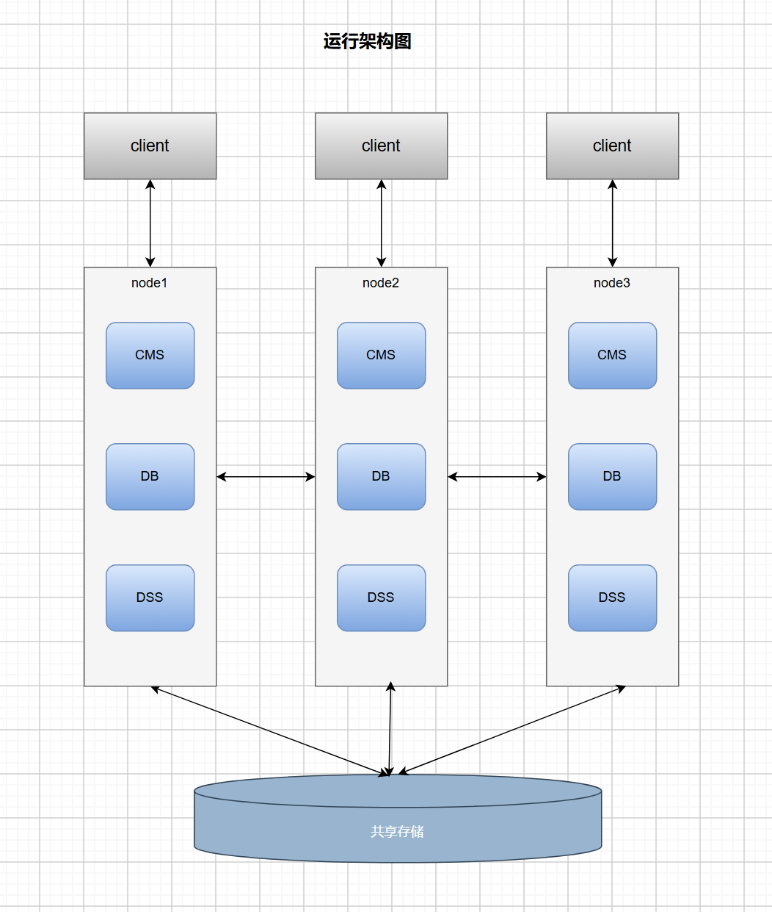
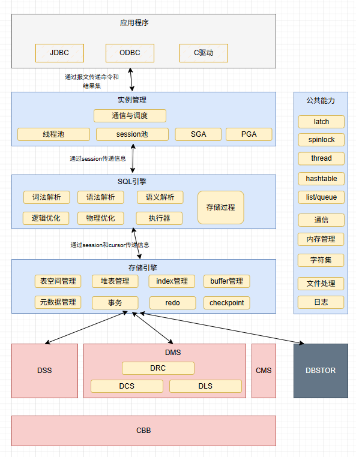

# 产品架构 

## 运行架构

- oGRAC是基于共享存储的集群架构。
- 由cms集群管理组件，DB数据库实例组件以及DSS开源集群文件系统组件组成。

## 逻辑架构

- 当前支持的驱动有 JDBC 驱动、C 语言的 oGRAC 驱动和 ODBC 驱动，后续还会支持 Go 和 Python 驱动；
- oGRAC的实例管理模块包括通信管理和服务调度，线程池管理，Session会话池管理以及全局内存管理SGA和私有内存管理PGA；
- SQL引擎模块：支持词法解析，语法解析，语义解析，逻辑优化，物理优化，执行器以及存储过程；
- 存储引擎模块：表空间管理，堆表（Heap）管理，索引管理，Page Buffer缓存管理，DC元数据管理，事务管理，Redo管理，Checkpoint；
- DSS模块是基于LUN的高性能的共享集群文件系统；
- DBStor模块是基于华为Dorado存储系统的给oGRAC专用的存储系统，它提供Page Pool和Redo Log接口；
- DMS是多写共享集群服务，提供DRC分布式资源管理、DLS分布式锁服务、DCS分布式缓存服务能力；
- CMS是集群管理组件；
- CBB模块是供DSS和DMS用的基础能力库，包括通信，数据结构，安全，文件等；
