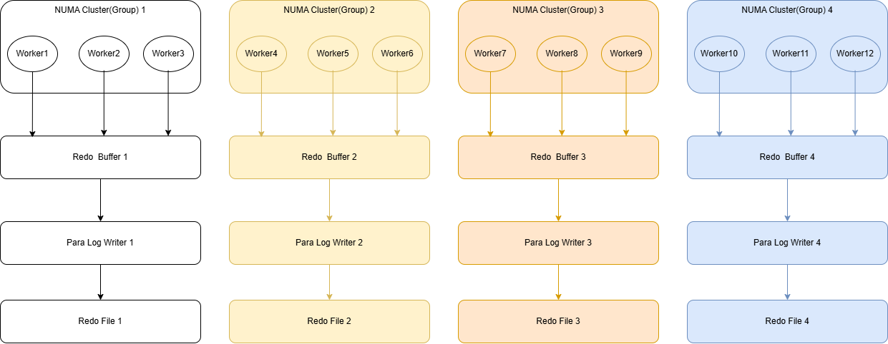
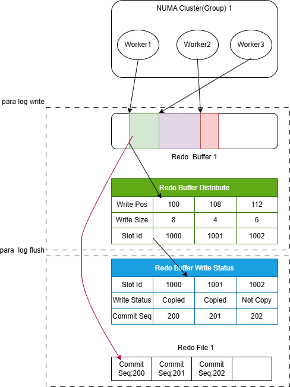

# 并行持久化REDO

## 核心目标

在oGRAC以前的架构中，REOD的持久化主要由单一业务线程(agent)或单一写redo线程(log_proc)完成。业务线程共享全局的REDO Buffer和一套REDO文件集合，所有事务的REDO由刷盘线程或抢到锁的线程进行拼接组装然后持久化，整个过程是串行的。在多核服务器与高并发的业务场景中，这种持久化REDO的过程成为了影响事务提交的瓶颈，同时由于持久化REDO线程的唯一性导致无法充分发挥出多核架构的并行能力。

基于上述的问题，并行持久化REDO(后面简称为并行刷盘)的目标是通过将业务线程根据物理机的NUMA亲和性划分为多个组，在每个组内起一个刷盘线程，整个oGRAC有多个刷盘线程同时写多个REDO文件，组与组之间的REDO Buffer和REDO文件互相独立，组之间的刷盘逻辑也互相独立，从而最大程度地发挥出多核架构下的并行能力。

## 工作机制

### 特性说明

并行刷盘的总体架构如图所示：

这里以4个NUMA Cluster(Group)单位为例(Cluster是比NUMA更小的一个维度，一个NUMA内部可以划分为多个Cluster，常见的比如鲲鹏920B，一共有4个NUMA，40个Cluster)。在并行刷盘的架构下，每个业务线程会自动绑定到某一个Cluster中，每个刷盘线程会在该Cluster上申请自己的REDO Buffer，同时在初始化建库的时候会给每个刷盘线程都创建Redo文件集合。业务线程将自身产生的Redo写入到对应的Redo Buffer中，刷盘线程再将Redo持久化到对应的Redo文件中。

相比于串行持久化Redo，并行的主要改动集中在业务线程写Redo(原log_write逻辑)、刷盘线程持久化Redo(原log_commit_flush逻辑)、ckpt和故障恢复等功能适配。同时需要考虑整个数据库的事务原子性和一致性，即保证数据库需要遵从的ACID。为了达成该目的，在并行刷盘的内部，每个Cluster中有控制管理REDO Buffer中写REDO的状态表，控制整体REDO推进的LSN位图数组，通过判断全局连续的REDO刷新到的位置决定事务是否可以提交。其示意图可参考如下：

### 特性范围

并行刷盘的特性主要包含以下部分：

- 硬件拓扑自适应：自动识别当前主机环境的NUMA节点个数, Cluster个数，以及每个CPU核的归属关系，确定需要启动的刷盘线程数量，确定每个业务线程需要绑定的Cluster序号。
- 并行写Redo到Redo Buffer：每个业务线程通过无锁化操作抢占Redo Buffer中的写位置，按抢占顺序确定提交次序。
- 并行写Redo到Redo File：每个Cluster一个刷盘线程，将Redo Buffer中连续的完成写入的Redo区间写入的存储的Redo文件中，持久化完成后以原子位图的方式推进全局已写入的Redo序号。
- CKPT：适配CKPT，ckpt使用flushed lsn进行推进，每次数据页持久化完成后推进rcy point。
- 故障恢复：多线程并行扫描每个刷盘线程的redo文件，按照提交次序统一归并后连续回放并统一回收。

### 约束与限制

由于并行刷盘对于Redo的组织形式相比与串行发生了区别，所以并行刷盘与串行刷盘互斥且不可以来回切换。需要用户在安装oGRAC前就确认后续使用并行刷盘还是串行刷盘，安装后不可以更改。如需更改，需要重新安装数据库并执行数据导入。

当前并行刷盘属于创新特性，以下周边特性目前暂时不支持：RBPS，归档，双集群，逻辑复制，流复制，RAFT主备模式。后续会逐步补全支持。

## 相关参数配置

ENABLE_PARA_LOG_FLUSH：是否开启并行刷盘，只支持数据库安装前修改。

ENABLE_PARA_LOG_DFX：是否开启并行刷盘的DFX功能，可以打印并行刷盘执行过程中更加详细的运行日志信息。

