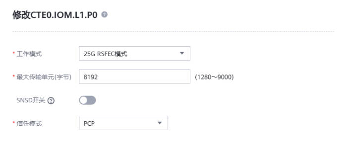
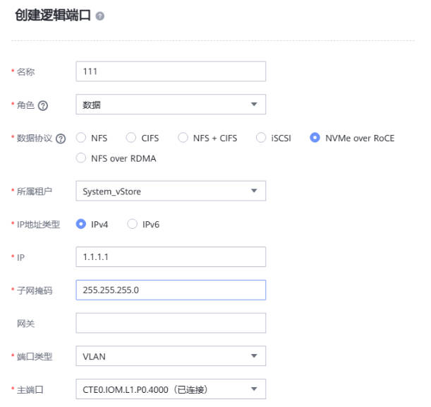
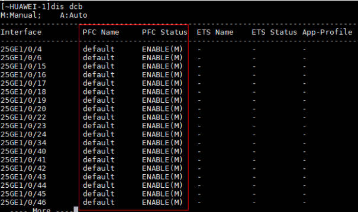

# 基于鲲鹏服务器的NoF连通性配置指导

## 内容简介

本章节主要介绍基于鲲鹏服务器+华为高性能网卡+华为企业级集中式存储阵列+华为交换机典型配置下，服务器与存储阵列间通过NoF连通的配置指导。

## 硬件环境

- 硬件环境要求：
    |资源名称|配置|
    |:--|:--|
    |鲲鹏服务器|鲲鹏920系列|
    |高性能网卡| 网卡硬件支持队列数量至少为64以上，支持RoCE能力，推荐型号： **华为高性能网卡SP670/SP680/SP681**，速率25GE以上|
    |磁阵| 支持Nvme Over Roce/Nvme Over Fabrics能力，推荐型号：**华为企业集中式存储阵列Dorado 18000 V6**；磁阵配置的网卡也需要支持RoCE能力，速率在25GE以上|
    |交换机| 支持RoCE，25GE/100GE，支持无损网络配置|

## 软件环境

- 软件环境要求：
    |资源名称|版本|
    |:--|:--|
    |OS|openEuler 24.03-LTS SP1|
    |网卡驱动|华为技术支持社区发布的与OS配套的最新版本|

## 组网方式


## 安装网卡驱动

1. 获取网卡驱动: [华为高性能网卡SP6XX系列驱动下载链接](https://support.huawei.com/enterprise/zh/computing/in220-pid-253287505/software/)

2. 在OS上安装ROCE驱动需要的依赖：
```
yum install rdma-core libibverbs nvme-cli
```
3. 上传驱动到服务器，解压后，执行安装驱动的脚本
```
sh install.sh nic roce
```
4. 安装完成后重启服务器，所有数据库服务器均需要执行上述操作
```
sync;reboot
```
    
## 存储侧配置

前提：存储阵列的RoCE网卡已经连接到交换机

1. 登陆存储的DeviceManager，选择**服务$\rightarrow$网络$\rightarrow$ROCE网络**，选择连接正常的RoCE端口，点击操作$\rightarrow$修改，参考下图配置，主要配置MTU和信任模式
   

2. 选择**服务$\rightarrow$网络$\rightarrow$ROCE网络**，点击VLAN$\rightarrow$创建，选择连接正常的RoCE端口，参考下图配置：
   

3. 选择**服务$\rightarrow$网络$\rightarrow$逻辑端口**，点击创建，参考下图配置，主端口选择需要配置的物理端口：
   

## 交换机配置
    
NVMe over RoCE对网络要求较高，要求交换机能够支持无损以太网，支持PFC死锁检测和抑制/隔离等，此处以Huawei CE6865交换机配置为例：

1. 交换机使能PFC功能并配置死锁检测。
```
[~HUAWEI-1]dcb pfc 
[~HUAWEI-1-dcb-pfc-default]priority 3 
[~HUAWEI-1-dcb-pfc-default]priority 3 deadlock-detect time 10 deadlock-recovery time 15 
[~HUAWEI-1-dcb-pfc-default]priority 3 turn-off threshold 20 
[~HUAWEI-1-dcb-pfc-default]commit
```
2. 交换机侧添加VLAN 4000
```
[~HUAWEI-1]vlan 4000
[~HUAWEI-1]commit
```
3. 交换机端口使能PFC功能，所有规划使用NOF网络的端口均需要配置。
```
[~HUAWEI-1]interface 25GE2/0/19 
[~HUAWEI-1-25GE2/0/19]undo flow-control
[~HUAWEI-1-25GE2/0/19]dcb pfc enable mode manual 
[~HUAWEI-1-25GE2/0/19]commit
```
4. 配置端口VLAN。
```
[~HUAWEI-1]interface 25GE2/0/19 
[~HUAWEI-1-25GE2/0/19]port link-type trunk 
[~HUAWEI-1-25GE2/0/19]port trunk allow-pass vlan 4000
[~HUAWEI-1-25GE2/0/19]commit
```
5. 确认端口使能PFC成功

   

## 主机配置

前提：主机的RoCE端口已经连接到交换机，网卡驱动安装成功

1. 编辑RoCE网口配置文件/etc/sysconfig/network-scripts/ifcfg-enp135s0f0，配置IP如下（每个RoCE网口均需配置，以enp135s0f0为例，UUID是系统自动生成的，无需拷贝下面的示例）：
```
TYPE=Ethernet
PROXY_METHOD=none
BROWSER_ONLY=no
BOOTPROTO=none
DEFROUTE=no
IPV4_FAILURE_FATAL=no
IPV6INIT=no
IPV6_AUTOCONF=no
IPV6_DEFROUTE=no
IPV6_FAILURE_FATAL=no
IPV6_ADDR_GEN_MODE=eui64
NAME=enp135s0f0
UUID=5ed95eb7-c279-4b04-a5ce-5d5e92b5c84e
DEVICE=enp135s0f0
ONBOOT=yes
MTU=8192
VLAN_EGRESS_PRIORITY_MAP=0:3,1:3,2:3,3:3,4:3,5:3,6:3,7:3

```
2. 对RoCE物理口创建VLAN网口（每个RoCE网口均需配置，以enp135s0f0为例），并定义egress优先级。IP和VLAN请按照预先规划好的配置。
```
echo "BOOTPROTO=static
IPADDR=1.1.1.1
PREFIX=24
IPV4_FAILURE_FATAL=no
NAME=enp135s0f0.4000
DEVICE=enp135s0f0.4000
ONBOOT=yes
MTU=8192
VLAN=yes
VLAN_EGRESS_PRIORITY_MAP=0:3,1:3,2:3,3:3,4:3,5:3,6:3,7:3
" > /etc/sysconfig/network-scripts/ifcfg-enp135s0f0.4000
```
3. 使修改后的物理网口和VLAN网口生效（每个RoCE网口均需操作，以enp135s0f0为
例）。
```
[root@server01 ~]# ifdown enp135s0f0
[root@server01 ~]# ifup enp135s0f0
[root@server01 ~]# ifdown enp135s0f0.4000
[root@server01 ~]# ifup enp135s0f0.4000
[root@server01 ~]# ip link set enp135s0f0.4000 type vlan egress-qos-map 0:3 1:3 2:3 3:3 4:3 5:3 6:3 7:3
```

<a id="point1"></a>
4. 配置网口的PFC和优先级队列（每个RoCE网口均需操作，以enp135s0f0为
例）。
```
hinicadm3 qos -i  enp135s0f0 -t dcb -e 1
hinicadm3 qos -i  enp135s0f0 --dev_trust pcp
hinicadm3 qos -i  enp135s0f0 --port_trust pcp
hinicadm3 qos -i  enp135s0f0 -t pfc -e 1 -f 0,0,0,1,0,0,0,0
hinicadm3 qos -i  enp135s0f0 --dev_defcos 3
hinicadm3 qos -i  enp135s0f0 --port_defcos 3
ifdown enp135s0f0
ifup enp135s0f0
ifdown enp135s0f0.4000
ifup enp135s0f0.4000
ip link set enp135s0f0.4000 type vlan egress-qos-map 0:3 1:3 2:3 3:3 4:3 5:3 6:3 7:3
```

<a id="point2"></a>
## 主机连接存储

前提：已完成前面的所有配置，且配置成功

1. 加载nof驱动，连接磁阵IP，以磁阵IP为`1.1.1.2`为例
```
modprobe nvme-fabrics
nvme discover -t rdma -a 1.1.1.2

## nqn.2020-02.huawei.nvme:nvm-subsystemsn-2102353GTE10L6000001是discover那一步查询显示到的nqn
nvme connect -t rdma -a 1.1.1.2 -n nqn.2020-02.huawei.nvme:nvm-subsystemsn-2102353GTE10L6000001 -i 4 -W 4
```
2. 检查配置是否正确，hinic0是OS的RoCE网卡对应的，也可能是hinic1
```
watch -d -n 1 "hinicadm3 counter -i hinic0 -t 1 -x 82"
```
显示如下有cos3字样表示正确，否则为配置不正确，请排查前面的所有配置
```
ROCE traffic RX/TX Counter:
ID-0000:tx_bytes_roce_port0_cos0: 0x0000000000003fc0 0000000000000033
ID-0003:tx_bytes_roce_port0_cos3: 0x00000f9900cea7b2 000000014e10bb6d
ID-0020:rx_bytes_roce_port0_cos0: 0x00000000000ef600 000000000000016e
ID-0023:rx_bytes_roce_port0_cos3: 0x0000052f7bff3d98 00000000a9aedbf7

```

## 注意事项

1. 当前ROCE网卡驱动不支持在64K页面大小的OS版本上安装，请确认OS版本的页面大小为4K
2. 服务器重启后，PFC配置和与磁阵连通需要重新操作，一定要先配置PFC后再配置连通磁阵（即先做[主机配置的步骤4](#point1)再做[主机连接存储](#point2)），也可以把命令整合成脚本做成系统启动服务
