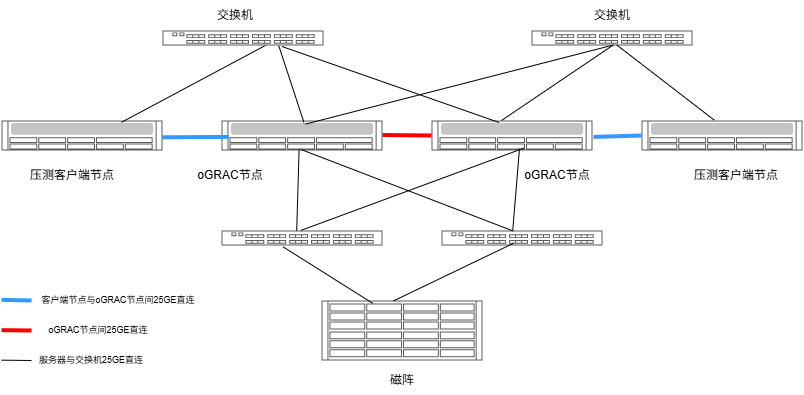

# oGRAC性能调优指南

## 内容简介

本章节主要介绍oGRAC测试TPCC的极限性能的测试方法，以及为达到最佳tpmC性能所依赖的硬件环境、数据库相关参数调优和OS调优。

## 硬件环境

- 硬件环境要求：
    |资源名称|配置|
    |:--|:--|
    |oGRAC服务器|鲲鹏920B 2\*80 core , 1 TiB DDR6 MEM, 2\*3 TiB NVME DISK，2 \* 高性能网卡（网卡配置参考第三行）|
    |压测客户端服务器|鲲鹏920 2\*48 core （或以上）, 1 TiB DDR6 MEM, 2\*3 TiB NVME DISK，2 \* 高性能网卡（网卡配置参考第三行）|
    |高性能网卡| 网卡硬件支持队列数量至少为64以上，支持RoCE能力，推荐型号： **华为高性能网卡SP670/SP680/SP681**，速率25GE以上，每台服务器配置2张，每张的网口数量至少为2个 |
    |磁阵| 支持Nvme Over Roce/Nvme Over Fabrics能力，推荐型号：**华为企业集中式存储阵列Dorado 18000 V6**；磁阵配置的网卡也需要支持RoCE能力，速率在25GE以上|
    |交换机| 支持RoCE，25GE/100GE，支持无损网络配置|

## 软件环境

- 软件环境要求：
    |资源名称|版本|
    |:--|:--|
    |数据库|oGRAC 8.0.0 LTS |
    |TPCC客户端|[适用于oGRAC的benchmarksql工具](https://gitcode.com/opengauss/oGRAC-common-tools)|
    |OS|openEuler 24.03-LTS SP1|
    |网卡驱动|华为技术支持社区发布的与OS配套的最新版本|

## 组网方式



## 磁阵连通性配置指导

- oGRAC节点可以通过iSCSI、FC、NoF三种协议与磁阵连接，可以参考磁阵厂商提供的连通性指导进行配置
- 排除硬件异常、线缆异常后，理论上的IO时延性能排序为 **NoF 优于 FC 优于 iSCSI**
- 由于NoF的配置相比iSCSI和FC要求稍高，这里给出基于华为高性能网卡+华为企业级集中式存储阵列+鲲鹏服务器的NoF的简易配置指导，参考[基于鲲鹏服务器的NoF配置指导](./nof_configure_guide.md)

## 主机BIOS和OS部分调优

1. 主机BIOS参数设置（不同BIOS版本配置项对应的位置可能有差异，请以实际为准）

    - BIOS$\rightarrow$Advanced$\rightarrow$MISC Configuration，配置Support Smmu为Disabled
    - BIOS$\rightarrow$Advanced$\rightarrow$Memory Configuration，配置Die Interleaving为Disable
    - BIOS$\rightarrow$Advanced$\rightarrow$Power And Performance Configuration，配置Performance Profile为HPC
    - BIOS$\rightarrow$Advanced$\rightarrow$Power And Performance Configuration，配置Power Policy为Performance Profile
    - BIOS$\rightarrow$Advanced$\rightarrow$Power And Performance Configuration$\rightarrow$CPU PM Control，配置CPU Prefetching为Enabled
    - BIOS$\rightarrow$Advanced$\rightarrow$Power And Performance Configuration$\rightarrow$CPU PM Control，配置SMT2为Enabled
    - BIOS$\rightarrow$Advanced$\rightarrow$Power And Performance Configuration$\rightarrow$CPU PM Control，配置TidCMP为Disabled

2. 操作系统优化

    - 关闭irqbalance
    
        ```bash
        systemctl stop irqbalance
        ```

    - 调整numa_balance

        ```bash
        echo 0 > /proc/sys/kernel/numa_balancing
        ```

    - 调整透明大页

        ```bash
        echo 'never' > /sys/kernel/mm/transparent_hugepage/enabled
        echo 'never' > /sys/kernel/mm/transparent_hugepage/defrag
        ```

## 磁盘IO队列调度机制设置
    
1. 针对磁盘IO队列调度机制设置，此处的sd*表示使用的磁阵的LUN映射在主机侧的块设备盘符。
    
    ```bash
    echo none > /sys/block/sd*/queue/scheduler
    ```
    
## 网卡中断绑核

建议对oGRAC节点间连通的网口、客户端节点与oGRAC节点间连通的网口、oGRAC节点与磁阵连通的网口进行绑核操作，具体参考如下：

1. 设置网卡的队列数量为最大
    ```
    ethtool -l enp4s0

    ## combined数量设置为Pre-set maximums显示支持的最大
    ethtool -L enp4s0 combined 64
    ```
2. 获取网卡对应的中断号
    ```
    [root@localhost]# cat /proc/interrupts | grep enp4s0 | awk '{print $1$NF}'
    405:enp4s0_qp0
    406:enp4s0_qp1
    407:enp4s0_qp2
    408:enp4s0_qp3
    ...
    ```
3. 绑定对应的CPU核，用网卡最大支持的combined数量除以服务器的numa个数，得到每个numa中选多少CPU进行绑定。这里推荐绑定到每个numa对应的CPU范围的后n个。比如网卡最大支持的combined数量为64，服务器的numa个数为4，则每个numa中选16个CPU进行绑定。4个numa对应的CPU范围依次为：0-95，96-191，192-287，288-383，那么绑定的CPU范围为80-95，176-191，272-287，368-383
    ```
    [root@localhost]# echo 80 >  /proc/irq/405/smp_affinity_list
    [root@localhost]# echo 81 >  /proc/irq/406/smp_affinity_list
    [root@localhost]# echo 82 >  /proc/irq/407/smp_affinity_list
    [root@localhost]# echo 83 >  /proc/irq/408/smp_affinity_list
    ...
    ```
## 准备测试工具

准备TPCC测试客户端，在所有的压测客户端节点上操作。
1. 下载适配oGRAC的TPCC测试工具。
    
    ```bash
    [root@localhost]# git clone https://gitcode.com/opengauss/oGRAC-common-tools.git
    ```

2. 下载安装JDK和ant依赖包。
    
    ```bash
    [root@localhost]# yum install ant java-11-openjdk
    ```

3. 在BenchmarkSQL所在目录下输入ant命令进行编译，编译成功后会生成build和dist两目录。
    
    ```bash
    [root@localhost]# cd /home/oGRAC-common-tools/benchmarksql_ograc
    [root@localhost]# ant
    Buildfile: /home/oGRAC-common-tools/benchmarksql_ograc/build.xml
    ...
    BUILD SUCCESSFUL
    Total time: 1 second
    ```

4. [下载对应的JDBC驱动](https://opengauss.org/zh/download/)至BenchmarkSQL目的lib/postgresql文件夹，并解压，删除自带的JDBC驱动。
    
    ```bash
    [root@localhost]# pwd
    /home/oGRAC-common-tools/benchmarksql_ograc/lib/postgres
    [root@localhost]# ls
    openGauss-JDBC-7.0.0-RC3.tar.gz  postgresql-9.3-1102.jdbc41.jar
    [root@localhost]# rm -f postgresql-9.3-1102.jdbc41.jar
    [root@localhost]# tar -xf openGauss-JDBC-7.0.0-RC3.tar.gz
    [root@localhost]# ls
    openGauss-JDBC-7.0.0-RC3.tar.gz  postgresql.jar
    ```

5. 调整性能测试相关配置
- 工具已经提供了配置示例`/home/oGRAC-common-tools/benchmarksql_ograc/run/ograc_run.og`，修改其中连接串的IP和端口即可。其中nodeId表示压测节点的ID，nodeCnt表示压测节点的数量。
- 如果要同时压测两个节点，可以同时起两个压测客户端，一个压测客户端使用的测试配置中nodeId配置为0，另一个压测客户端使用的测试配置中nodeId配置为1。
    ```bash
    db=postgres
    driver=org.postgresql.Driver
    conn=jdbc:oGRAC://x.x.x.x:1661
    nodeId=0
    nodeCnt=2
    user=TPCC
    password=XXXXXXX
    warehouses=2000
    loadWorkers=100
    terminals=1000
    runTxnsPerTerminal=0
    runMins=15
    limitTxnsPerMin=0
    terminalWarehouseFixed=true
    newOrderWeight=45
    paymentWeight=43
    orderStatusWeight=4
    deliveryWeight=4
    stockLevelWeight=4
    ```

## 安装oGRAC数据库

1. 建议按如下示例准备好5个LUN设备，挂载到待安装的两个oGRAC节点上，此处以NoF组网为例

    |LUN用途|大小|DEV名称|
    |:--|:--|:--|
    |GCC DISK|5GB|/dev/nvme2n1 |
    |DATA DISK|4TB|/dev/nvme2n2 |
    |NODE 0 REDO DISK|2TB|/dev/nvme2n3|
    |NODE 1 REDO DISK|2TB|/dev/nvme2n4 |
    |REDO ARCHIVE DISK|2TB|/dev/nvme2n5 |

2. 准备安装配置文件`config_params_lun.json`内容如下（另一个节点安装时只需修改node_id为1，redo_size建议至少为150G）：

    ```json
    {
        "deploy_mode": "dss",
        "node_id": "0",
        "cms_ip": "1.1.1.1;1.1.1.2",
        "db_type": "1",
        "mes_ssl_switch": false,
        "MAX_ARCH_FILES_SIZE": "300G",
        "redo_num": "3",
        "redo_size": "200G",
        "auto_tune": "0",
        "dss_vg_list": {
            "vg1": "/dev/nvme2n2",
            "vg2": "/dev/nvme2n3",
            "vg3": "/dev/nvme2n5",
            "vg4": "/dev/nvme2n4"
        },
        "gcc_home": "/dev/nvme2n1",
        "cms_port": "14587",
        "dss_port": "1811",
        "ograc_port": "1611",
        "interconnect_port": "1601,1602",
        "_SHM_KEY": 17,
        "module_config": {
            "ograc_home": "/home/ograc/app",
            "data_root": "/home/ograc/dbdata",
            "user": "ograc"
        },
        "install_type": "override"
    }
    ```
3. 安装两节点oGRAC集群环境。参考[oGRAC 两节点部署指南](https://docs.opengauss.org/zh/docs/latest/ograc/installation_guide/two_nodes_guide/ograc_two_node_installation.html)。


## 设置性能测试使用的数据库参数（极限性能测试使用）

前提：oGRAC两节点集群已经安装成功

1. 切换到数据库安装用户下面执行如下命令，分别在节点0和节点1上执行
    ```sql
    #连接数据库
    ogsql / as sysdba -q

    #执行如下SQL
    alter system set ENABLE_SYSDBA_REMOTE_LOGIN = TRUE;
    alter system set ENABLE_SYS_REMOTE_LOGIN = TRUE;
    alter system set _OPTIM_SUBQUERY_REWRITE = true;
    alter system set CHECKPOINT_PERIOD = 60;
    alter system set CHECKPOINT_PAGES = 2000000;
    alter system set BUF_POOL_NUM = 128;
    alter system set _UNDO_ACTIVE_SEGMENTS = 1024;
    alter system set UNDO_RETENTION_TIME = 60;
    alter system set DATA_BUFFER_SIZE = '768G';
    alter system set ENABLE_MERGE_JOIN = false;
    alter system set TIMED_STATS = false;
    alter system set SQL_STAT = false;
    alter system set STATS_LEVEL = basic;
    alter system set JOB_QUEUE_PROCESSES = 0;
    alter system set JOB_THREADS = 0;

    ## 这里配置的是需要监听的IP，需要配置客户端节点与oGRAC节点间连通的IP地址
    alter system add LSNR_ADDR 'x.x.x.x';
    alter system add hba entry 'host * 0.0.0.0/0';
    alter system reload hba config;

    alter system set BUF_POOL_NUM = 3072;
    alter system set UNDO_RESERVE_SIZE = 512;
    alter system set _UNDO_AUTO_SHRINK = TRUE;
    alter system set _UNDO_PERF_PREALLOC = TRUE;
    alter system set _UNDO_PREALLOC_PAGES = 4000;

    alter system set LOG_BUFFER_COUNT = 64;
    alter system set DTC_CKPT_NOTIFY_TASK_RATIO = 0.125;
    alter system set DTC_CLEAN_EDP_TASK_RATIO = 0.125;
    alter system set DTC_TXN_INFO_TASK_RATIO = 0.25;
    alter system set AUDIT_LEVEL = 0;

    ## 这里配置的是CPU范围，根据服务器实际的CPU范围配置(可以通过系统命令lscpu确定)，配置范围为在每个numa对应的CPU范围中，减去前2个核和后面8个核，即比如numa0对应cpu范围是0-79，对应配置为2-71，依此类推
    alter system set CPU_GROUP_INFO = '2-71 82-151 162-231 242-311';
    ```
2. 分别重启节点0和节点1数据库
   ```bash
    cms res -stop db -node 0
    cms res -start dss -node 0
    cms res -start db -node 0
    cms res -stop db -node 1
    cms res -start dss -node 1
    cms res -start db -node 1
   ```

## 创建测试数据库和用户
    
1. 在节点0创建数据库tpcc及用户tpcc。
    ```sql
    #连接数据库
    ogsql / as sysdba -q

    #执行如下SQL
    create user TPCC identified by 'xxxxxxx';
    grant create session to TPCC;
    grant create table to TPCC;
    grant dba to TPCC;
    grant inherit privileges on user SYS to TPCC;
    ```

## 预先扩展数据文件

预扩展数据文件，可以避免在性能压测的时候由于扩展数据文件带来的性能波动。
测试1000仓数据时，建议预扩userX.dat扩到200G；测试2000仓数据时，建议预扩userX.dat扩到500G

1. 在节点0上执行如下操作
    ```sql
    #连接数据库
    ogsql / as sysdba -q

    #执行如下SQL
    alter database datafile '+vg1/undo01.dat' resize 32G;
    alter database datafile '+vg1/undo11.dat' resize 32G;
    alter database datafile '+vg1/undo02.dat' resize 32G;
    alter database datafile '+vg1/undo12.dat' resize 32G;
    alter database datafile '+vg1/user1.dat' resize 500G;
    alter database datafile '+vg1/user2.dat' resize 500G;
    alter database datafile '+vg1/sysaux' resize 10G;
    ```

## 修改测试客户端配置
    
1. 进入BenchmarkSQL目录下的run文件夹，编辑benchmarksql配置文件，修改测试参数，包括数据库用户名、密码、IP、端口、数据库。
    
    ```bash
    [root@localhost]# cd /home/oGRAC-common-tools/benchmarksql_ograc/run/
    [root@localhost]# vim ograc_run.og
    db=postgres
    driver=org.postgresql.Driver
    conn=jdbc:oGRAC://x.x.x.x:1661 ## oGRAC节点与客户端节点连通的IP
    nodeId=0 ## 节点ID
    nodeCnt=2 ## 总节点数量
    user=TPCC
    password=XXXXXX
    warehouses=2000
    loadWorkers=100
    terminals=1000
    runTxnsPerTerminal=0
    runMins=15
    limitTxnsPerMin=0
    terminalWarehouseFixed=true
    newOrderWeight=45
    paymentWeight=43
    orderStatusWeight=4
    deliveryWeight=4
    stockLevelWeight=4
    ```

## 导入测试数据
    
1. 执行如下命令导入测试数据。

    ```bash
    [root@localhost]# sh runDatabaseBuild.sh ograc_run.og
    ```

## 执行测试

1. 执行如下命令开始测试。
    ```bash
    [root@localhost]# sh runBenchmark.sh ograc_run.og
    ```
2. 如果需要测试两节点多写性能，需要分别在连接oGRAC节点0的压测客户端节点0和连接oGRAC节点1的压测客户端节点1上同时启动两个TPCC测试（节点1的ograc_run.og中将nodeId修改为1）

## 观察系统资源工具

- htop 观察CPU使用情况
- iostat 查看系统IO使用情况：`iostat -xdk 1`
- sar 查看网络使用情况：`sar -n DEV 1`
- 通过执行SQL监控oGRAC的等待事件：`ogsql / as sysdba -q -c "select EVENT,count(sid) from DV_SESSION_WAITS where WAIT_TIME_MIRCO > 0 group by EVENT;"`
  
  正常情况下，等待事件耗时最多的是`log file sync`，因为大量线程在并发等待REDO日志落盘。如果不是，需要结合实际的等待事件进行分析。

## 测试结果参考

- 在鲲鹏920B服务器(320core)+OceanStor Dorado 18000 V6集中式存储的环境上，按上述步骤执行TPCC测试的参考结果如下，测试数据量为2000仓，每个节点1000并发：

    |节点名称|仓数|并发数|tpmC(NewOrders)|
    |:--|:--|:--|:--|
    |节点0| 2000 | 1000 | 200w |
    |节点1| 2000 | 1000 | 192w |