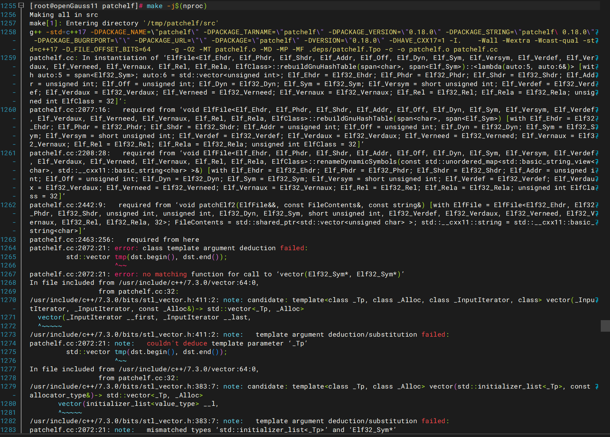

# 因gcc版本兼容及三方库路径配置错误导致patchelf编译失败问题

## 一、问题现象

在openEuler 20.03 aarch64环境按官方文档编译patchelf 0.18.0时，先后出现两类报错：

1. 使用系统默认gcc 7.3.0编译阶段报错：

```shell
patch-elf2.cc:2072:21: error: template argument deduction failed
 std::vector tmp(dst.begin(), dst.end());
```



2. 切换oGRAC第三方包内gcc 10.3.1后，configure阶段报错：

```shell
configure: error: C compiler cannot create executables
See `config.log' for more details
```

查看`config.log`可见核心报错：

```shell
/tmp/patchelf/openGauss-third_party_binarylibs_openEuler_2203_arm/buildtools/gcc10.3/gcc/bin/../libexec/gcc/aarch64-unknown-linux-gnu/10.3.1/cc1: error while loading shared libraries: libisl.so.15: cannot open shared object file: No such file or directory
```

3. 尝试手动挂载依赖库路径时，因Shell语法错误触发导出异常：

```shell
bash: export: `:/tmp/patchelf/openGauss-third_party_binarylibs_openEuler_2203_arm/buildtools/gcc10.3/isl/lib': not a valid identifier
```

## 二、定位方法

1. 首先分析`make`阶段报错，确认是C++17新特性兼容性问题，锁定gcc版本过低的根因。
2. 切换gcc 10.3.1后，查看`config.log`定位到`cc1`加载`libisl.so.15`失败，确认编译器依赖缺失。
3. 执行`find $THIRD -name 'libisl*'`检索三方包内库文件，确认`libisl.so.15`实际位于`buildtools/gcc10.3/isl/lib`目录下，而非此前误判的`buildtools/isl/lib`根目录。
4. 修正`LD_LIBRARY_PATH`后通过`ldd`命令验证编译器依赖加载情况，确认`libisl.so.15`可被正常识别。

## 三、问题根因

本问题是多层配置偏差叠加导致的编译失败，核心原因分为两类：

1. **初始编译根因**：patchelf 0.18.0引入了C++17的类模板参数推导（CTAD）特性，而openEuler 20.03默认搭载的gcc 7.3.0仅对C++17提供实验性支持，标准库未实现`std::vector`从迭代器对自动推导类型的重载，直接导致源码编译失败。
2. **切换编译器后衍生根因**：
   - 路径认知偏差：oGRAC第三方依赖包中`isl`、`mpfr`、`gmp`运行库嵌套在`buildtools/gcc10.3/`子目录下，而非`buildtools`根目录，初期路径配置错误导致`cc1`无法加载`libisl.so.15`。
   - Shell语法错误：使用反斜杠`\`换行拼接环境变量时，下一行开头误加空格，Shell将冒号开头的路径误判为新变量名，触发`not a valid identifier`报错，导致依赖库路径未实际生效。

## 四、解决方法

### 1. 常规修复步骤

按以下步骤修正配置后重新编译：

```bash
# 定义三方包根目录
THIRD=/tmp/patchelf/openGauss-third_party_binarylibs_openEuler_2203_arm
# 修正依赖库路径（注意反斜杠后无空格，路径指向gcc10.3子目录）
export LD_LIBRARY_PATH=$THIRD/buildtools/gcc10.3/gcc/lib64\
:$THIRD/buildtools/gcc10.3/isl/lib\
:$THIRD/buildtools/gcc10.3/mpfr/lib\
:$THIRD/buildtools/gcc10.3/gmp/lib\
:$LD_LIBRARY_PATH
# 彻底清理旧编译缓存
cd /tmp/patchelf
make clean
rm -f config.cache config.status Makefile
# 重新执行编译流程
./bootstrap.sh
./configure --prefix=/usr/local
make -j$(nproc)
make install
# 验证版本
patchelf --version  # 输出patchelf 0.18.0即成功
```

> 注意：必须清理旧编译缓存，否则configure会复用错误的历史配置，仍会触发编译失败。

### 2. 备选简化方案（跨节点拷贝）

若无需从源码闭环编译，可直接从已部署成功的oGRAC节点拷贝二进制文件，无需调整编译环境：

```bash
# 从成功节点拷贝patchelf二进制
scp root@<成功节点IP>:/usr/local/bin/patchelf /usr/local/bin/
chmod +x /usr/local/bin/patchelf
patchelf --version
```
