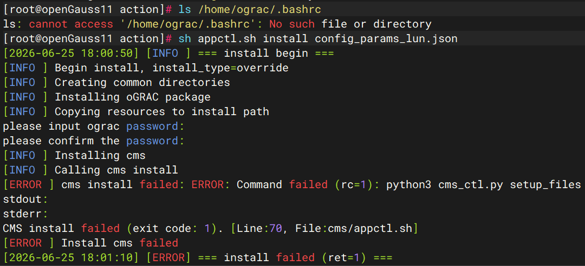

# CMS 安装失败——残留用户家目录缺失 `.bashrc` 文件


#### 现象描述

在两节点部署 oGRAC 执行 `sh appctl.sh install config_params_lun.json` 时，安装流程在 **CMS 组件安装阶段** 中断，报错信息如下：

```text
[EROR]cms install failed: CMS install failed:[Errno 2] No such file or directory:'/home/ograc/.bashrc'
```

安装脚本自动终止，未生成完整的 oGRAC 二进制环境。



#### 常见原因

此问题通常由 **历史安装残留未彻底清理** 导致，具体场景包括：

1. 上一次卸载 oGRAC 时，未使用 `userdel -r ograc` 彻底删除 `ograc` 用户及其家目录，仅手动删除了 `/opt/ograc` 等运行目录。
2. 残留的 `ograc` 用户家目录（`/home/ograc`）被保留，但目录内的 `.bashrc` 等环境配置文件已丢失或被误删。
3. 本次重新安装时，安装脚本检测到 `ograc` 用户已存在，未重新初始化家目录环境，导致 CMS 组件在配置用户环境变量时无法找到 `/home/ograc/.bashrc` 文件。

#### 排查与解决建议

1. **确认用户残留状态**
   在两节点分别执行以下命令，检查 `ograc` 用户是否存在：
   ```bash
   id ograc
   ls -la /home/ograc/.bashrc
   ```

   若用户存在但 `.bashrc` 文件不存在，即可确认为本问题。
2. **彻底清理残留用户与环境**
   在安装前，务必完全清除历史残留（需 `root` 用户执行）：
   ```bash
   # 停止并卸载现有环境（若仍在运行）
   sh appctl.sh stop
   sh appctl.sh uninstall override
   
   # 彻底删除 ograc 用户及其家目录
   userdel -r ograc
   # 确认无其他相关用户残留
   userdel -r ogdba 2>/dev/null
   groupdel ogdba 2>/dev/null
   
   # 清理可能残留的安装目录
   rm -rf /opt/ograc /data/ograc_install
   ```
3. **重新执行安装流程**
   清理完成后，重新执行预安装与安装命令，脚本会自动创建全新的 `ograc` 用户并生成完整的家目录环境：
   ```bash
   sh appctl.sh pre_install config_params_lun.json
   sh appctl.sh install config_params_lun.json
   ```
