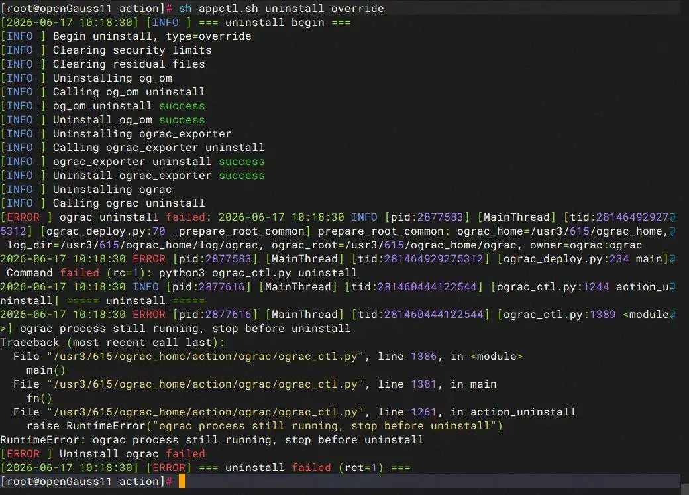

# oGRAC 卸载失败（进程残留导致）

**现象描述**

在公用环境中，第一套 oGRAC 集群卸载完成后，尝试卸载第二套 oGRAC 环境时，执行 `sh appctl.sh uninstall override`命令失败，控制台报错信息如下：

```
RuntimeError: ograc process still running, stop before uninstall
[ERROR] Uninstall ograc failed
```


**原因分析**

1. **进程残留**：第一套 oGRAC 环境卸载时，可能因非正常退出或脚本清理不彻底，导致部分 `ograc`、`dss`或 `cms`相关进程仍在后台运行，占用了系统资源（如端口、共享内存、文件锁等）。
2. **环境冲突**：公用环境下，第二套 oGRAC 的安装目录、用户、端口或共享内存 Key（`_SHM_KEY`）若与第一套环境存在重叠或冲突，卸载脚本检测到活跃进程时会主动终止操作以防止数据损坏。
3. **共享存储残留**：若第一套环境使用了共享 LUN，且未完全清理 DSS 的持久化注册信息（Persistent Reservation），可能导致第二套环境在卸载时误判进程状态。

**解决方案**

1. **手动停止残留进程**： 
```
# 切换到 root 用户 
# 检查并终止相关进程 
ps -ef | grep -E 'ograc|dss|cms' | grep -v grep 
kill -9 <PID>  
# 逐个终止查看到的进程
```
2. **清理共享内存与信号量**： 
```
# 查看并清理共享内存段（注意确认_SHM_KEY值）\
ipcs -m | grep ograc 
ipcrm -m <shmid> 
# 清理信号量
ipcs -s | grep ograc 
ipcrm -s <semid>
```
3. **强制清理环境（谨慎操作）**： 
```
# 删除安装目录及用户（确保数据已备份）
rm -rf /opt/ograc /data/ograc_install 
userdel -r ograc 
groupdel ogdba 
# 清理共享盘注册信息 
sg_persist --out --clear --param-rk=<key> /dev/dss-disk*
```
4. **重试卸载**：完成上述清理后，重新执行卸载命令。

**预防措施**

- 卸载第一套环境后，务必通过 `ps`、`ipcs`等命令确认无相关进程残留。
- 在公用环境中部署多套 oGRAC 时，务必为每套环境分配独立的安装目录、用户、端口及 `_SHM_KEY`（修改 `config_params_lun.json`）。
- 卸载前先执行 `sh appctl.sh stop`确保集群完全停止。