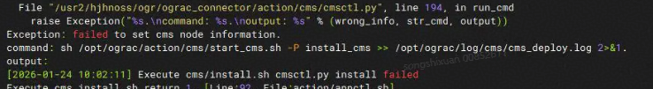
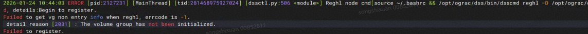

# oGRAC 安装部署常见问题定位与解决指南

本文档用于总结 **oGRAC 在安装与部署过程中常见的稳定性问题**，并给出对应的 **定位思路与解决方案**。文档重点面向 **首次部署或缺乏共享存储经验的开发者**，帮助在安装失败时快速判断问题类型、缩小排查范围。

---

## 问题定位前的基础信息收集

在定位任何安装问题之前，建议优先完成以下信息收集工作，这将极大提升问题排查效率。

### 安装与运行日志路径

oGRAC 各组件在安装和运行过程中，均会生成对应日志，统一存放在以下目录：

```text
/opt/ograc/log
```

常见日志说明如下：

* `xxx_deploy.log`

  * 组件的 **总体安装日志**
  * 记录组件安装流程、关键步骤及 `log / error` 信息
  * 是定位安装失败原因的首要参考日志

* `run` 子目录下日志

  * 部分组件在该目录下会生成运行日志
  * 可用于分析组件 **启动后失败或异常退出** 的原因

> **建议**：当安装失败时，优先从对应组件的 `*_deploy.log` 开始查看，再结合 `run` 目录中的日志进行综合分析。

---

### 装失败后的二进制留存策略

当前 oGRAC 安装脚本采用 **可重入设计**：

* 一旦安装失败，会 **自动清理已安装的二进制文件**
* 仅保留日志目录，方便再次执行安装

该策略在多数场景下是合理的，但在以下情况下可能增加问题定位难度：

* `DSS` 组件需要直接与 **共享 LUN** 进行注册和操作
* 对共享存储经验不足的开发者，难以及时感知 LUN 层面的异常
* 安装失败后二进制被清理，无法辅助进行二次验证

#### 保留二进制文件用于辅助定位

在需要保留二进制以辅助问题分析时，可临时修改卸载脚本：

编辑文件：

```text
[package_path]/ograc_connector/action/uninstall.sh
```

在 **文件首行** 添加：

```shell
exit 0
```

该修改可防止在安装失败后自动清理二进制文件。

#### 注意事项（重要）

> **警告**：启用该方式后：
>
> * 后续再次执行 `uninstall` 或 `install` 可能失败
> * 定位完成后，必须手动清理残留环境

手动清理示例如下：

```shell
rm -rf /opt/ograc
userdel -r ograc
userdel -r ogdba
groupdel ogdba
useradd ogdba
```

仅建议在 **问题定位阶段临时使用**，定位完成后请恢复原始脚本。

---

## 常见问题类型

### LUN 异常导致的安装失败

在两节点或多节点部署场景中，共享存储是最容易引发安装失败的环节，相关问题通常集中在 **CM 投票盘** 和 **DSS 共享盘** 两类。

---

#### CM 投票盘（gcc-disk）异常

##### 现象描述

* 安装过程中在 **CM 阶段失败**
* 两节点在初始化或启动 CM 时异常退出
* 日志中可能出现心跳写入失败、`load disk` 相关报错



##### 常见原因

* `gcc-disk` 软链接错误
* 两节点的 `gcc-disk` **未指向同一块共享盘**
* 投票盘在抹除或初始化阶段无法正常写入

##### 排查与解决建议

1. 确认两节点 `gcc-disk` 指向同一 LUN
2. 使用 `/dev/disk/by-id` 等稳定路径重新建立软链接
3. 确认投票盘未被其他业务占用

> **提示**：CM 投票盘用于集群仲裁，一旦异常，集群将无法正常启动。

---

#### DSS LUN 组异常

##### 现象描述

* 安装过程中的 `install` 或 `start` 阶段失败
* DSS 组件无法启动
* 在以下日志中出现异常信息：

```text
/opt/ograc/log/dss/run/instance.log
```



##### 常见原因

* 共享 LUN 已被其他集群或历史环境注册
* 先前安装未正常卸载，残留注册信息
* 其他业务对共享盘进行了 Persistent Reservation

---

#### DSS LUN 注册冲突的排查与清理

##### 查看 LUN 注册信息

```shell
sg_persist --in --read-keys /dev/xxx
```

若返回如下内容，说明该 LUN 已存在注册信息：

```text
PR generation=0xb6, 2 registered reservation keys follow:
0x1
0x2
```

---

##### 清理注册信息

对每一个已注册的 key 执行清理操作：

```shell
sg_persist --out --clear --param-rk=<key> /dev/xxx
```

其中 `<key>` 为上一步查询到的 reservation key。

---

##### 确认清理结果

再次执行：

```shell
sg_persist --in --read-keys /dev/xxx
```

若输出如下内容：

```text
there are NO registered reservation keys
```

说明共享盘注册信息已成功清理，可重新执行安装或启动流程。

---

## 总结

在 oGRAC 的安装部署过程中，大多数稳定性问题集中在 **共享存储与集群组件初始化阶段**。当遇到安装失败时，建议遵循以下排查顺序：

1. 优先查看安装日志，明确失败阶段
2. 判断是否涉及共享 LUN 或 CM/DSS 组件
3. 必要时保留二进制进行辅助分析
4. 确认共享盘注册状态与软链接一致性

通过系统化排查，可大幅降低重复安装和误操作成本。
