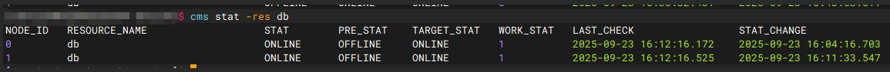

# oGRAC 两节点部署指南

## 1. 文档简介

本文档用于指导开发者在 **两台物理机或虚拟机** 上完成 oGRAC 的 **两节点集群安装与部署**。

---

## 2. 安装前须知

### 2.1 硬件要求

oGRAC 两节点部署至少需要两台服务器，推荐硬件规格如下：

* 主机数量：2 台 ARM 架构物理机或 DCS 虚拟机
* 单台主机最低推荐配置：
* 
  * 内存：16 GB
  * CPU：8 核
  * 磁盘可用空间：不少于 100 GB
* 共享盘要求：
  * 需要至少 4 块裸 LUN 盘（且不能为分区 LUN），所在存储节点需与两台主机处于同一组网，并可直接访问。
> **说明**：资源不足可能导致安装阶段失败，尤其是在共享存储和 CM 组件初始化时。

---

### 2.2 操作系统要求

* 支持的操作系统版本：

  * openEuler 20.03 LTS (aarch64)
  * openEuler 22.03 LTS (aarch64)
  * openEuler 24.03 LTS (aarch64)

> **建议**：建议使用上述版本安装包。其余系统环境可自行编译安装包，但官方未进行完整兼容性验证。

---

## 3. 安装准备

以下步骤需要在两台节点上分别执行，且需使用 `root` 用户，除非特别说明。

### 3.1 系统初始化
> **提示**：如下操作建议仅在测试或非生产环境中执行；如需在生产环境执行，请先咨询运维管理人员确认安全策略，勿直接关闭防火墙。

为避免 SELinux 和防火墙影响节点通信及数据库进程启动，需要对其进行处理。

```shell
setenforce 0
sed -i 's/^SELINUX=.*/SELINUX=disabled/' /etc/selinux/config
systemctl stop firewalld
systemctl disable firewalld
```

### 3.2 安装系统依赖

oGRAC 安装依赖 Python、时间同步和网络工具，请在两节点上执行：

```shell
yum install -y wget ntpdate chrony python3 python3-devel iputils iproute patchelf lz4 --skip-broken
```

要求lz4版本在1.8.3以上。

注意：当前 `openEuler 20.03` 官方源中没有 `patchelf` 安装包，如使用`openEuler 20.03`系统需手动安装 `patchelf`：
```shell
yum install -y gcc make automake autoconf libtool 
# 拉取patchelf, 推荐 0.18.0
git clone https://github.com/NixOS/patchelf.git 
cd patchelf 
./bootstrap.sh
# 根据个人使用情况,可以利用--prefix指定安装路径
./configure --prefix=/usr/local 
make -j$(nproc) 
make install
# 输出应该类似：patchelf 0.18.0
patchelf --version
```
---

## 4. 获取并准备安装包

### 4.1 创建安装目录

建议新建单独的安装目录（本文档以 `/data` 目录为例），请勿在 `/home` 或系统目录下下载或安装软件包，以避免权限问题。

```shell
mkdir -p /data/ograc
cd /data/ograc
```
---

### 4.2 下载安装包
通过如下命令，可查看节点对应的操作系统版本，以获取对应架构的安装包：
```shell
cat /etc/os-release
```

在节点 0 和节点 1 的当前目录下，从官网下载对应的官方安装包，各个ARM系统版本的安装包下载地址如下：
```shell
# openEuler 20.03
wget https://opengauss.obs.cn-south-1.myhuaweicloud.com/7.0.0-RC3/oGRAC/openGauss-oGRAC-openEuler20.03-aarch64-RELEASE.tgz
# openEuler 22.03
wget https://opengauss.obs.cn-south-1.myhuaweicloud.com/7.0.0-RC3/oGRAC/openGauss-oGRAC-openEuler22.03-aarch64-RELEASE.tgz
# openEuler 24.03
wget https://opengauss.obs.cn-south-1.myhuaweicloud.com/7.0.0-RC3/oGRAC/openGauss-oGRAC-openEuler24.03-aarch64-RELEASE.tgz
```
---

## 5. 两节点共享存储准备

### 5.1 LUN 规划说明

oGRAC 两节点集群需要使用共享存储，请提前在存储侧准备 **4 个 LUN** 并完成主机组映射，使得两个节点均能访问到这四块盘。

推荐规划如下（示例）：

* 1 × 5G：CM 仲裁盘
* 1 × 4T：Redo 盘
* 2 × 2T：数据盘、归档盘

LUN 容量可根据实际业务需要进行适当调整。对于性能敏感环境，应保证数据盘和 Redo 盘容量充足，以避免无法满足日志和业务数据需求。常规大小关系建议满足 `数据盘 > Redo 盘 > 归档盘 > CM 仲裁盘`。

通过下列命令查询分配的四块盘，获取以 `scsi` 或 `wwn` 开头的设备编号：
```shell
ll /dev/disk/by-id
```

随后将四块盘链接到如下目录：

```shell
ln -s /dev/disk/by-id/scsi-disk1 /dev/dss-disk1 #数据盘
ln -s /dev/disk/by-id/scsi-disk2 /dev/dss-disk2 #Redo盘
ln -s /dev/disk/by-id/scsi-disk3 /dev/dss-disk3 #归档盘
ln -s /dev/disk/by-id/scsi-disk4 /dev/gcc-disk #CM仲裁盘
```

四块盘说明用途如下表所示：

| 软链接       | 用途     | DSS 卷   | 建议大小 |
| --------- | ------ | ------- | ---- |
| gcc-disk  | CM 仲裁盘 | 不纳入 LUN 管理组件管理 | 5G   |
| dss-disk1 | 数据盘    | vg1     | 2T   |
| dss-disk2 | Redo 盘 | vg2     | 4T   |
| dss-disk3 | 归档盘    | vg3     | 2T   |

> **说明**：`gcc` 为 CM 组件内部名称，与编译器无关。

之后需要对这四块盘进行授权，使 `DSS` 组件能够访问这些磁盘。执行如下命令：
```shell
ll /dev/disk/by-id/scsi-disk1
# 获取 /dev/sdx 对应的软链接目标盘符
chmod 777 /dev/sdx
```
随后即可开始后续安装步骤。

---

### 5.2 解压安装文件

在两节点上分别执行，其中 `os version` 为当前下载的架构版本：

```shell
cd /data/ograc
tar -zxvf openGauss-oGRAC-openEuler[os version]-aarch64-RELEASE.tgz
chmod -R 777 ograc_connector
chown -R root:root ograc_connector
```

---

### 5.3 时间同步配置

集群环境对时间一致性要求较高，请先执行 `date` 命令检查各节点时间是否一致；若一致，则可跳过该步骤，否则请务必完成时间同步。（若使用虚拟机，需先关闭与宿主机的时间同步策略，防止出现时间跳变问题。）

#### 情况一：节点可访问外网

两节点分别执行：

```shell
ntpdate -u [外网ntp服务器网址]
```

#### 情况二：无外网环境

* 节点 0 作为时间服务器
* 节点 1 向节点 0 同步时间

**节点 0：**

```shell
sed -i "1i allow all" /etc/chrony.conf
systemctl restart chronyd
sed -i 's/^#local stratum 10/local stratum 10/' /etc/chrony.conf
ss -unlp | grep chronyd
```

**节点 1：**

```shell
sed -i "1i server [节点1 IP地址] iburst" /etc/chrony.conf
systemctl enable --now chronyd
systemctl restart chronyd  #若后续由于其他因素导致时间偏差过大，可通过该命令快速触发强制同步
chronyc tracking
```

---

## 6. 配置安装参数

### 6.1 修改配置文件

进入 action 目录并编辑 `config_params_lun.json`：

```shell
cd /data/ograc/ograc_connector/action
vim config_params_lun.json
```

配置重点注意事项：

1. 两节点 `node_id` 必须分别为 `0` 和 `1`
2. 内存较小的机器（如 DCS 虚拟机、内存小于 300 GB 的物理机等）请设置 `auto_tune = 1`
3. `redo_num × redo_size × 2` 应小于 Redo 盘大小；

节点 0 示例（节点 1 仅需将 `node_id` 修改为 `1`）：

```json
{
    "deploy_mode": "dss",
    "node_id": "0",
    "cms_ip": "xxx.xxx.xxx.xxx;xxx.xxx.xxx.xxx",
    "db_type": "1",
    "mes_ssl_switch": false,
    "MAX_ARCH_FILES_SIZE": "300G",
    "redo_num": "6",
    "redo_size": "5G",
    "auto_tune": "1",
    "dss_vg_list": {
        "vg1": "/dev/dss-disk1",
        "vg2": "/dev/dss-disk2",
        "vg3": "/dev/dss-disk3"
    },
    "gcc_home": "/dev/gcc-disk",
    "cms_port": "14587",
    "dss_port": "1811",
    "ograc_port": "1611",
    "interconnect_port": "1601,1602",
    "_SHM_KEY": 17,
    "module_config": {
        "ograc_home": "/data/ograc_install/ograc",
        "data_root": "/data/ograc_install/dbdata",
        "user": "ograc"
    }
}

```
其中，各字段含义如下：

* deploy_mode：安装模式，当前应使用 `dss` 模式安装；
* deploy_user：安装管理用户；
* node_id：节点序号，从 `0` 开始；
* cms_ip：当前业务网络与心跳网络未分离时，填写两节点主机 IP 即可；
* mes_ssl_switch：MES 通信是否通过 SSL 加密；
* db_type：数据库标识，不建议修改；
* MAX_ARCH_FILES_SIZE：归档最大文件大小，建议不要超过归档盘大小；
* redo_num：Redo 文件数量；
* redo_size：Redo 文件大小。由于首次起库会通过 `dd` 抹除盘中所有内容，不建议设置过大，以免首次 `start` 时间过长；
* auto_tune：是否开启自适应参数配置（小规格机器建议开启）；
* dss_vg_list：分别对应数据盘、Redo 盘和归档盘盘符；
* gcc_home：CM 仲裁盘盘符；
* cms_port：CMS 端口，支持自定义；
* dss_port：DSS 端口，支持自定义；
* ograc_port：oGRAC 数据库端口，支持自定义；
* interconnect_port：oGRAC 数据库节点间通信端口，支持自定义；
* _SHM_KEY：共享内存 key 值。如果当前环境需要安装多个数据库，建议修改为唯一 key 值，以避免冲突；
* module_config：模块安装配置。其中 `ograc_home` 为 oGRAC 安装目录，`data_root` 为数据库数据目录（建议与安装目录使用统一根目录），`user` 为数据库用户，均支持自定义。
---

### 6.2 修改数据库兼容性[可选]

```shell
cd /data/ograc/ograc_connector/action
vim ograc/install_config.json
```

增加DBCOMPATIBILITY字段声明数据库的兼容性，支持指定为A/B/C兼容性，如下所示：
```json
{
  "R_INSTALL_PATH": "/opt/ograc/ograc/server",
  "D_DATA_PATH": "/mnt/dbdata/local/ograc/tmp/data",
  "l_LOG_FILE": "/opt/ograc/log/ograc/ograc_deploy.log",
  "M_RUNING_MODE": "ogracd_in_cluster",
  "p_PACKAGE_AND_VERSION": "-P",
  "Z_KERNEL_PARAMETER1": "CHECKPOINT_PERIOD=1",
  "Z_KERNEL_PARAMETER2": "OPTIMIZED_WORKER_THREADS=2000",
  "OG_CLUSTER_STRICT_CHECK": "TRUE",
  "UNINSTALL_F_CLEAN_DATABASE_AREA": "",
  "UNINSTALL_D_LOCATION_DATABASE_AREA": "/mnt/dbdata/local/ograc/tmp/data",
  "UNINSTALL_g_RUN_UNINSTALL_SCRIPT": "withoutroot",
  "UNINSTALL_s_UNINSTALL_WITH_GSS": "",
  "DBCOMPATIBILITY": "A"
}
```

## 7. 安装与启动集群
安装部署中遇到的常见问题可参见 `oGRAC安装部署常见问题定位与解决` 章节。
### 7.1 安装节点

在两节点上依次执行，建议等待节点 0 安装完毕后，再进行节点 1 安装。首先执行预安装：
```shell
sh appctl.sh pre_install config_params_lun.json
```
预安装成功后，执行安装：
```shell
sh appctl.sh install config_params_lun.json
```

在每次安装过程中，需要在如下阶段设置数据库`sys`用户密码：

```shell
please enter ograc_sys_pwd:
```

密码为字母、数字、特殊符号混合，不要求字母大写，两节点设置密码需相同。

---

### 7.2 启动节点

建议先启动节点 0，再启动节点 1，并在两个节点上依次执行：

```shell
sh appctl.sh start
```
其中，节点 0 首次 `start` 会创建 Redo 和数据文件，耗时较长，请耐心等待；节点 1 首次 `start` 不涉及该过程，耗时相对较短。

---

## 8. 集群状态检查

在任意节点执行如下命令，查询集群状态：

```shell
su -s /bin/bash ograc
cms stat -res db
```

如下图所示：



其中，主要关注 `STAT` 列，该列表示当前节点状态；当两节点均为 `ONLINE` 时，表示集群节点状态正常。

`PRE_STAT`为先前节点状态，`TARGET_STAT`为理想状态，可作为故障场景下的参考状态。

此时，可以在该集群上简单验证数据库功能，在两个节点上分别执行：
```shell
su -s /bin/bash ograc
ogsql / as sysdba -q
```

进入数据库命令终端，在其中一个节点上执行：

```shell
create table test(a int);
insert into test values(123);
commit;
```

随后在另一个节点上执行：

```shell
select * from test;
```

即可获得之前数据，由此可见数据库功能正常。

---

### （可选）运行oGRAC两节点多写功能测试DEMO

集群安装成功后，可以参考 [oGRAC两节点多写功能测试DEMO使用指南](./ograc_two_nodes_multiwrite_testdemo.md)，运行 oGRAC 两节点多写功能测试 DEMO。

## 9. 重新安装oGRAC
如果需要在该环境上重新部署 oGRAC，需先停止集群并完成卸载清理，之后方可重新安装。
### 9.1 停止服务
分别在节点 0 和节点 1 的 `/data/ograc/ograc_connector/action` 目录下，以 `root` 用户执行以下命令停止节点。
```shell
cd /data/ograc/ograc_connector/action
sh appctl.sh stop
```

### 9.2 卸载清理
随后，分别在节点 0 和节点 1 执行以下命令进行卸载：
```shell
sh appctl.sh uninstall override
```

随后即可更换包版本或修改配置文件，重新按照文档步骤进行安装。

---

## 10. 总结

至此，oGRAC 两节点部署指南结束。如有疑问，请联系 openGauss 官方社区，相关开发人员将提供支持。
